## INDICE
 

 1. Introducción.

<!-- .element: class="fragment" data-fragment-index="1"-->

 2. Superficies Cuádricas.

<!-- .element: class="fragment" data-fragment-index="2"-->

 3. Supercuádricos.

<!-- .element: class="fragment" data-fragment-index="3"-->

 4. Representaciones de Spline.

<!-- .element: class="fragment" data-fragment-index="4"-->

 5. Metodos de Interpolación de Spline.

<!-- .element: class="fragment" data-fragment-index="5"-->

 6. Spline Racionales.

<!-- .element: class="fragment" data-fragment-index="6"-->

 7. Conversión entre representaciones de Spline.

<!-- .element: class="fragment" data-fragment-index="7"-->

 8. Despliegue de curvas  y superficies de Spline.

<!-- .element: class="fragment" data-fragment-index="8"-->

### INTRODUCCIÓN: Líneas y Superficies Curvas
 

	Entrada:  
	Conjunto de funciones matemáticas

<!-- .element: class="fragment" data-fragment-index="1"-->

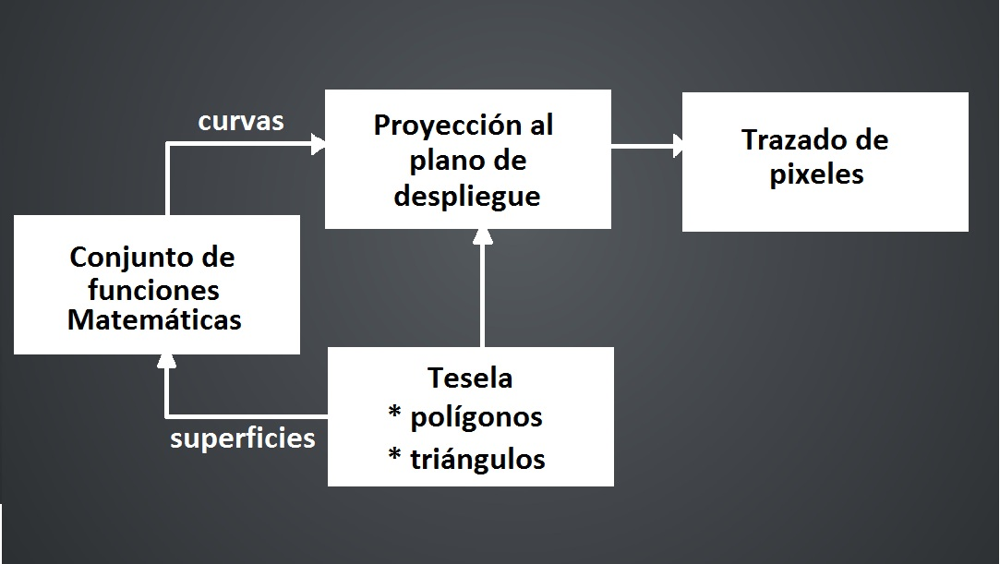 <!-- .element: class="fragment" data-fragment-index="2"-->

### INTRODUCCIÓN: Líneas y Superficies Curvas

	Entrada: 
	Conjunto de Puntos de Coordenadas

<!-- .element: class="fragment" data-fragment-index="1"-->

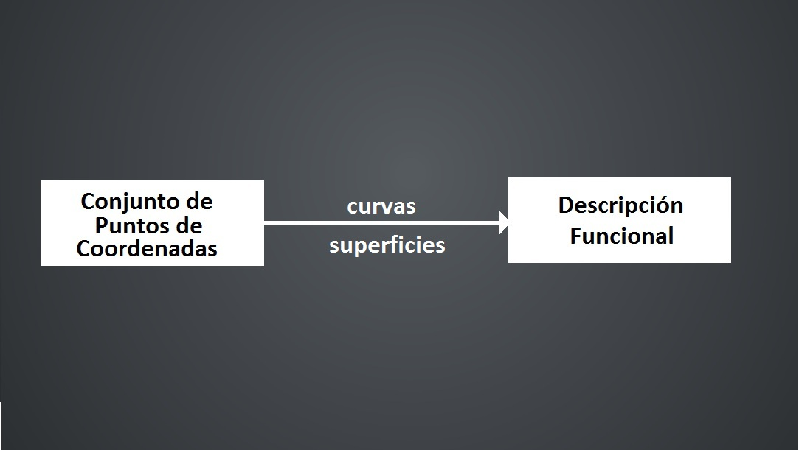 <!-- .element: class="fragment" data-fragment-index="2"-->

## SUPERFICIES CUADRICAS

<table width="550" heigth="500" border="0" align ="right">
<tr>
<td>
 

	Representación Cartesiana

<!-- .element: class="fragment" data-fragment-index="2"-->

 

	$x^{2}$ + $y^{2}$ + $z^{2}$ $=$ 
	$r^{2}$

<!-- .element: class="fragment" data-fragment-index="2"-->

 

	Representación Paramétrica

<!-- .element: class="fragment" data-fragment-index="3"-->

 

	$x=$
	$r$
	$\cos$
	$\varphi$
	$\cos$
	$\theta$

<!-- .element: class="fragment" data-fragment-index="3"-->

	$-\pi$$\leq$
	$\varphi$
	$\leq$$\pi$

<!-- .element: class="fragment" data-fragment-index="3"-->

	$y=$
	
	$r$
	$\cos$
	$\varphi$
	$\cos$
	$\theta$

<!-- .element: class="fragment" data-fragment-index="3"-->

	$-\pi/2$$\leq$
	$\theta$
	$\leq$$\pi/2$

<!-- .element: class="fragment" data-fragment-index="3"-->

	$z=$
	$r$
	sen
	$\varphi$

<!-- .element: class="fragment" data-fragment-index="3"-->

</td>
</tr>
</table>

 

	Esfera

<!-- .element: class="fragment" data-fragment-index="1"-->

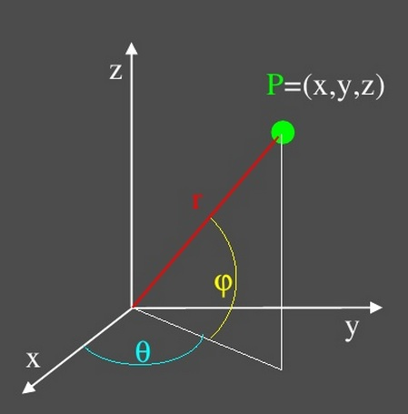<!-- .element: class="fragment" data-fragment-index="1"-->

	Parametros:

<!-- .element: class="fragment" data-fragment-index="3"-->

	1. 
	r

<!-- .element: class="fragment" data-fragment-index="3"-->

	2. 
	$\theta$

<!-- .element: class="fragment" data-fragment-index="3"-->

	3. 
	$\varphi$

<!-- .element: class="fragment" data-fragment-index="3"-->

## SUPERFICIES CUADRICAS

<table width="540" heigth="500" border="0" align ="right">
<tr>
<td>
 

	Representación Cartesiana

<!-- .element: class="fragment" data-fragment-index="2"-->

 

	$(x/$
	$r_x$
	$)^{2}$ + $(y/$
	$r_y$
	$)^{2}$ + $(z/$
	$r_z$
	$)^{2}$ $= 1$

<!-- .element: class="fragment" data-fragment-index="2"-->

 

	Representación Paramétrica

<!-- .element: class="fragment" data-fragment-index="3"-->

 

	$x=$
	$r_x$
	cos
	$\varphi$
	$\cos$
	$\theta$

<!-- .element: class="fragment" data-fragment-index="3"-->

	$-\pi$$\leq$
	$\varphi$
	$\leq$$\pi$

<!-- .element: class="fragment" data-fragment-index="3"-->

	$y=$
	$r_x$
	$\cos$
	$\varphi$
	$\cos$
	$\theta$

<!-- .element: class="fragment" data-fragment-index="3"-->

	$-\pi/2$$\leq$
	$\theta$
	$\leq$$\pi/2$

<!-- .element: class="fragment" data-fragment-index="3"-->

	$z=$
	$r_x$
	sen$\varphi$

<!-- .element: class="fragment" data-fragment-index="3"-->

</td>
</tr>
</table>

	Elipsoide

<!-- .element: class="fragment" data-fragment-index="1"-->

 
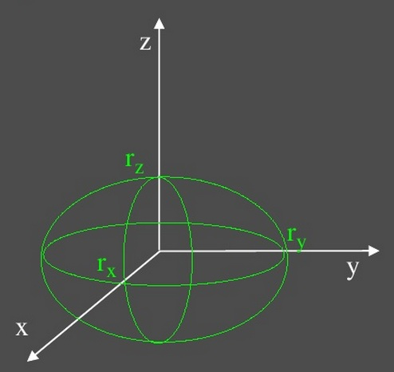<!-- .element: class="fragment" data-fragment-index="1"-->

	$\quad $No Olvidar el Toro

<!-- .element: class="fragment" data-fragment-index="4"-->

## SUPERCUADRICOS

	Concepto

<!-- .element: class="fragment" data-fragment-index="1"-->

 
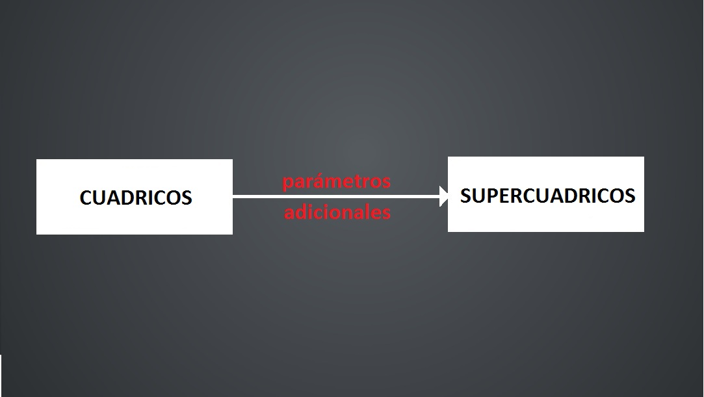<!-- .element: class="fragment" data-fragment-index="2"-->

## SUPERCUADRICOS

	Superelipse

<!-- .element: class="fragment" data-fragment-index="1"-->

	Representación Cartesiana

<!-- .element: class="fragment" data-fragment-index="2"-->

 

	$(x/$
	$r_x$
	$)^{2/}$
	$^{S}$
	 + $(y/$
	$r_y$
	$)^{2/}$
	$^{S}$
	 $=$ 1

<!-- .element: class="fragment" data-fragment-index="2"-->

 

	Representación Paramétrica

<!-- .element: class="fragment" data-fragment-index="3"-->

 

	$x=$
	$r_x$
	$\cos$
	$^{S}$
	$\theta$

<!-- .element: class="fragment" data-fragment-index="3"-->

	$y=$
	$r_y$
	$\cos$
	$^{S}$
	$\theta$

<!-- .element: class="fragment" data-fragment-index="3"-->

	$-\pi$$\leq$
	$\theta$
	$\leq$$\pi$

<!-- .element: class="fragment" data-fragment-index="3"-->

 

	Con 
	$S$
	 $= 1$ obtenemos una elipse ordinaria.

<!-- .element: class="fragment" data-fragment-index="4"-->

## SUPERCUADRICOS

<table width="650" heigth="500" border="0" align ="right">
<tr>
<td>

 

	Representación Cartesiana

<!-- .element: class="fragment" data-fragment-index="2"-->

 

	$((x/$
	$r_x$
	$)^{2/}$
	$^{S2}$
	+$(y/$
	$r_y$
	$)^{2/}$
	$^{S2}$
	$)$
	$^{S2/S1}$
	+$(z/ $
	$r_z$
	$)^{2/}$
	$^{S1}$
	$= 1$

<!-- .element: class="fragment" data-fragment-index="2"-->

 

	Representación Paramétrica

<!-- .element: class="fragment" data-fragment-index="3"-->

 

	$x=$
	$r_x$
	$\cos$
	$^{S1}$
	$\varphi$
	$\cos$
	$^{S2}$
	$\theta$

<!-- .element: class="fragment" data-fragment-index="3"-->

	$-\pi/2$$\leq$
	$\varphi$
	$\leq$$\pi/2$

<!-- .element: class="fragment" data-fragment-index="3"-->

	$y=$
	$r_y$
	$\cos$
	$^{S1}$
	$\varphi$
	$\cos$
	$^{S2}$
	$\theta$

<!-- .element: class="fragment" data-fragment-index="3"-->

	$-\pi$$\leq$
	$\theta$
	$\leq$$\pi$

<!-- .element: class="fragment" data-fragment-index="3"-->

	$z=$
	$r_z$
	sen
	$^{S1}$
	$\varphi$

<!-- .element: class="fragment" data-fragment-index="3"-->

</td>
</tr>
</table>

	Superelipsoide

<!-- .element: class="fragment" data-fragment-index="1"-->

 
 
 
 

	Con
	$S1$
	 $=$ 
	$S2$
	 $= 1$ 

<!-- .element: class="fragment" data-fragment-index="4"-->

$\ $ obtenemos  una 

<!-- .element: class="fragment" data-fragment-index="4"-->

elipsoide ordinaria.

<!-- .element: class="fragment" data-fragment-index="4"-->

<!-- .slide: data-state="splines-state" -->
## REPRESENTACIONES DE SPLINE

 

	EJEMPLO

<canvas id="canvas1" width="600" height="400"></canvas>

<!-- .slide: data-state="cardinal-state" -->
## REPRESENTACIONES DE SPLINE

 

	EJEMPLO

<canvas id="canvas2"></canvas>

## REPRESENTACIONES DE SPLINE

 
 

	1. Introducción.

 <!-- .element: class="fragment" data-fragment-index="1"-->

 

	2. Definición del Problema.

 <!-- .element: class="fragment" data-fragment-index="2"-->

 

	3. Continuidad.

 <!-- .element: class="fragment" data-fragment-index="3"-->

 

	4. Modos de Especificación.

 <!-- .element: class="fragment" data-fragment-index="4"-->

## REPRESENTACIONES DE SPLINE

	 Introducción

 <!-- .element: class="fragment" data-fragment-index="1"-->

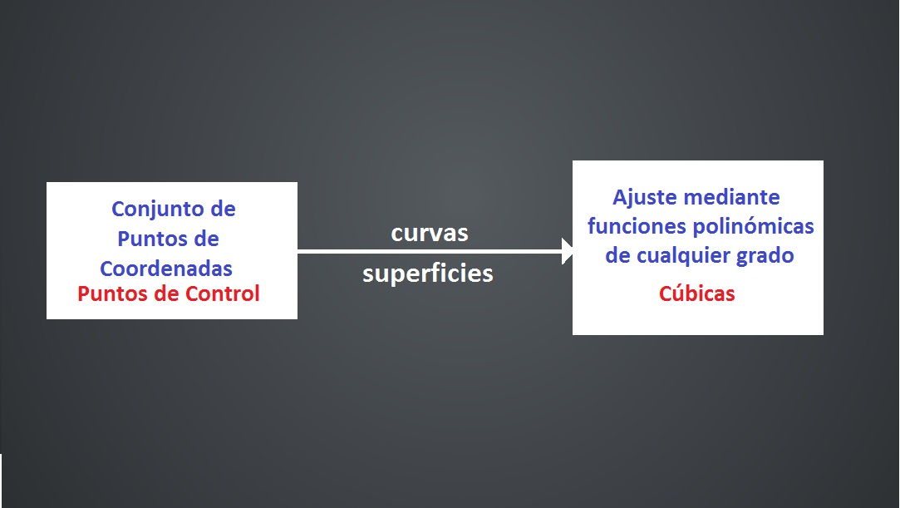<!-- .element: class="fragment" data-fragment-index="2"-->

	 Usos:

 <!-- .element: class="fragment" data-fragment-index="1"-->

	 1. Digitacilación de trazos.
	(Curvas de Interpolación)

 <!-- .element: class="fragment" data-fragment-index="3"-->

	 2. Especificación de trayectorias de animación. 
	(Curvas de Interpolación)

 <!-- .element: class="fragment" data-fragment-index="3"-->

	 3. Herramienta de diseño para superficies de los objetos. CAD(Curvas de aproximación)

 <!-- .element: class="fragment" data-fragment-index="3"-->

	 Ventaja

 <!-- .element: class="fragment" data-fragment-index="1"-->

	 La curva se modifica y manipula (trasladar, girar y escalar) solo en los puntos de control.

 <!-- .element: class="fragment" data-fragment-index="4"-->

## REPRESENTACIONES DE SPLINE

	 Introducción

 <!-- .element: class="fragment" data-fragment-index="1"-->

<!-- .element: class="fragment" data-fragment-index="1"-->

 
 

	1.$ \ $ La curva 
	realiza la interpolación.

 <!-- .element: class="fragment" data-fragment-index="2"-->

	2.$ \ $ La curva 
	aproxima la interpolación.

 <!-- .element: class="fragment" data-fragment-index="2"-->

	3.$ \ $
	 Casco convexo.

<!-- .element: class="fragment" data-fragment-index="2"-->

	4.$ \ $
	 Grafica de control.

<!-- .element: class="fragment" data-fragment-index="2"-->

## REPRESENTACIONES DE SPLINE

	 Deficición del problema

<!-- .element: class="fragment" data-fragment-index="1"-->

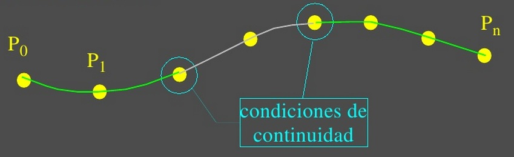<!-- .element: class="fragment" data-fragment-index="1"-->

	 Se pueden tener $1$ o varias
	 secciones
	 de spline.

 <!-- .element: class="fragment" data-fragment-index="2"-->

	 Cada 
	 sección
	 de la Spline se puede definir 
	paramétricamente
	 así:

 <!-- .element: class="fragment" data-fragment-index="2"-->

	 $P($
	$u$
	$) = ( x($
	$u$
	$), y($
	$u$
	$), z($
	$u$
	$) )^{T} \qquad \qquad \quad \ $
	$u_1$
	$\leq$
	$u$
	$\leq$
	$u_2$

<!-- .element: class="fragment" data-fragment-index="2"-->

 

	 La derivada de $P($
	$u$
	$)$ es el 
	vector tangente paramétrico
	 de la curva:

 <!-- .element: class="fragment" data-fragment-index="3"-->

	 $P'($
	$u$
	$) = ( x'($
	$u$
	$), y'($
	$u$
	$), z'($
	$u$
	$) )^{T} \qquad \qquad$
	$u_1$
	$\leq$
	$u$
	$\leq$
	$u_2$

<!-- .element: class="fragment" data-fragment-index="3"-->

## REPRESENTACIONES DE SPLINE

 

	 Continuidad

<!-- .element: class="fragment" data-fragment-index="1"-->

<table width="450" heigth="500" border="0" align ="right">
<tr>
<td>

 

	Cada 
	sección:

<!-- .element: class="fragment" data-fragment-index="2"-->

	 $P($
	$u$
	$) = ( x($
	$u$
	$), y($
	$u$
	$), z($
	$u$
	$) )^{T}$

 <!-- .element: class="fragment" data-fragment-index="2"-->

	$u_1$
	$\leq$
	$u$
	$\leq$
	$u_2$

<!-- .element: class="fragment" data-fragment-index="2"-->

 
 
 

	Cada 
	sección:

<!-- .element: class="fragment" data-fragment-index="3"-->

	 $P'($
	$u$
	$) = ( x'($
	$u$
	$), y'($
	$u$
	$), z'($
	$u$
	$) )^{T}$

 <!-- .element: class="fragment" data-fragment-index="3"-->

	$u_1$
	$\leq$
	$u$
	$\leq$
	$u_2$

<!-- .element: class="fragment" data-fragment-index="3"-->

</td>
</tr>
</table>

 

	 Continuidad Geométrica

<!-- .element: class="fragment" data-fragment-index="2"-->

	 $G^{0}$: 
	 Si los segmentos se unen.

<!-- .element: class="fragment" data-fragment-index="2"-->

	 $G^{1}$: 
	 Si $($ademas de 
	 $G^{0}$
	$)$ las direcciones de los vectores tangentes, aunque no necesariamente las magnitudes, son iguales.

<!-- .element: class="fragment" data-fragment-index="2"-->

 

	 Continuidad Paramétrica

<!-- .element: class="fragment" data-fragment-index="3"-->

	 $C^{n}$: 
	 Si $d^{n}/d$
	$u$
	$^{n}$
	 $P($
	$u$
	$)$, son iguales $($la enésima derivada en magnitud y dirección$)$

<!-- .element: class="fragment" data-fragment-index="3"-->

## REPRESENTACIONES DE SPLINE

	 Continuidad

<!-- .element: class="fragment" data-fragment-index="1"-->

<table width="900" heigth="500" border="0" align ="right">
<tr>
<td>

 

	Reglas:

<!-- .element: class="fragment" data-fragment-index="2"-->

	R1. 
	$C^{1}$
	$\rightarrow$
	$G^{1}$
	 pero no al revés:

<!-- .element: class="fragment" data-fragment-index="2"-->

	R2. 
	Si 
	$n$
	$>$
	$m$
	 entonces 
	$C^{n}$
	$\rightarrow$
	$C^{m}$

<!-- .element: class="fragment" data-fragment-index="2"-->

	Expresión de la 
	R1. 

<!-- .element: class="fragment" data-fragment-index="2"-->

</td>
</tr>
</table>

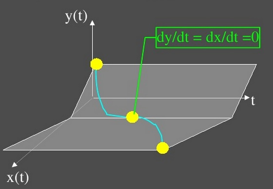<!-- .element: class="fragment" data-fragment-index="3"-->
<!-- .element: class="fragment" data-fragment-index="4"-->

## REPRESENTACIONES DE SPLINE

 

	 Continuidad

<!-- .element: class="fragment" data-fragment-index="1"-->
 
 
 

<table width="800" heigth="500" border="0" align ="right">
<tr>
<td>

	Existen 3 modos
	 equivalentes
	:

<!-- .element: class="fragment" data-fragment-index="2"-->

 

	1. Conjunto de 
	condiciones de frontera

<!-- .element: class="fragment" data-fragment-index="3"-->

	2. 
	Matriz característica 
	de la Spline

<!-- .element: class="fragment" data-fragment-index="4"-->

	3. 
	Funciones de combinación

<!-- .element: class="fragment" data-fragment-index="5"-->

</td>
</tr>
</table>

## TIPOS DE INTERPOLACIÓN DE SPLINE

 
 

	 1. Spline Cúbicas

<!-- .element: class="fragment" data-fragment-index="1"-->

 
 
 

	 2. Curvas y Superficies de Bezier

<!-- .element: class="fragment" data-fragment-index="2"-->

 
 
 

	 3. Curvas y Superficies de B-Spline

<!-- .element: class="fragment" data-fragment-index="3"-->

## SPLINE CÚBICAS

 

	 1. Spline Cúbicas Naturales

<!-- .element: class="fragment" data-fragment-index="1"-->

 
 

	 2. Hermite

<!-- .element: class="fragment" data-fragment-index="2"-->

 
 

	 3. Spline Cardinales

<!-- .element: class="fragment" data-fragment-index="3"-->

 
 

	 4. Splines de Kochanek-Bartels

<!-- .element: class="fragment" data-fragment-index="4"-->

## SPLINE CÚBICAS

	Definicion del $P_b$. en el caso 
	$ \qquad \qquad P($
	$u$
	$)=x($
	$u$
	$),y($
	$u$
	$),z($
	$u$
	$))^{T}$

<!-- .element: class="fragment" data-fragment-index="1"-->

	de polinonios cúbicos
	$ \qquad \qquad \qquad \qquad u_1$
	$\leq$
	$u$
	$\leq$
	$u_2$

<!-- .element: class="fragment" data-fragment-index="1"-->

	Para cada 
	sección 
	de la Spline:

<!-- .element: class="fragment" data-fragment-index="2"-->

	 $x($
	$u$
	$) = a_x$
	$u^{3}$
	$ + b_x$
	$u^{2}$
	$ + c_x$
	$u$
	$ + d_x$

 <!-- .element: class="fragment" data-fragment-index="2"-->

	 $y($
	$u$
	$) = a_y$
	$u^{3}$
	$ + b_y$
	$u^{2}$
	$ + c_y$
	$u$
	$ + d_y$

 <!-- .element: class="fragment" data-fragment-index="2"-->

	 $z($
	$u$
	$) = a_z$
	$u^{3}$
	$ + b_z$
	$u^{2}$
	$ + c_z$
	$u$
	$ + d_z$

 <!-- .element: class="fragment" data-fragment-index="2"-->

	$0 \leq$
	$u$
	$\leq 1$

<!-- .element: class="fragment" data-fragment-index="2"-->

	Vectorialmente tenemos: $ \ $
	$P($
	$u$
	$)=$
	$a$
	$u^{3}$
	$+$
	$b$
	$u^{2}$
	$+$
	$c$
	$u$
	$+$
	$d$
	$,$
	$ \qquad \quad  0 \leq$
	$u$
	$\leq 1$

<!-- .element: class="fragment" data-fragment-index="3"-->

	Entonces:
	$ \qquad \qquad \qquad P($
	$u$
	$) = $
	
	$
	\begin{bmatrix}
	u^{3} & u^{2} & u & 1 \cr
	\end{bmatrix}
	$
	$\bullet$
	
	$
	\begin{bmatrix}
	a & b & c & d \cr
	\end{bmatrix}
	$
	$^{T} = $
	$ U $
	$\bullet $
	$C$

<!-- .element: class="fragment" data-fragment-index="4"-->

	 $ \quad \ \ \qquad \qquad \qquad \qquad P'($
	$u$
	$) = $
	
	$
	\begin{bmatrix}
	3u^{2} & 2u & 1 & 0 \cr
	\end{bmatrix}
	$
	$\bullet$
	
	$
	\begin{bmatrix}
	a & b & c & d \cr
	\end{bmatrix}
	$
	$^{T}$

 <!-- .element: class="fragment" data-fragment-index="4"-->

	$ \quad \ \ \qquad \qquad \qquad \qquad 0 \leq$
	$u$
	$\leq 1$

<!-- .element: class="fragment" data-fragment-index="4"-->

	Tenemos $n+1$ 
	puntos de control
	 de coordenadas: 
	$ \qquad P_k$
	$ = ($
	$x_k$
	$,$
	$y_k$
	$,$
	$z_k$
	$)$
	$ \qquad k $
	$ = 0,1,2,...,n$

<!-- .element: class="fragment" data-fragment-index="5"-->

## SPLINE CÚBICAS

	Definicion del $P_b$. en el caso 
		$ \qquad \qquad P($
		$u$
		$)= x($
		$u$
		$),y($
		$u$
		$),z($
		$u$
		$))^{T}$

<!-- .element: class="fragment" data-fragment-index="1"-->

	$0 \leq$
	$u$
	$\leq 1 \qquad \qquad \qquad \ \ $

<!-- .element: class="fragment" data-fragment-index="1"-->

<table width="650" heigth="50" border="0" align ="left">
<tr>
<td>

	 $P($
	$u$
	$) = $
	
	$
	\begin{bmatrix}
	u^{3} & u^{2} & u & 1 \cr
	\end{bmatrix}
	$
	$\bullet$
	
	$
	\begin{bmatrix}
	a & b & c & d \cr
	\end{bmatrix}
	$
	$^{T} = $
	$ U $
	$\bullet $
	$C$

 <!-- .element: class="fragment" data-fragment-index="2"-->

	 $P'($
	$u$
	$) = $
	
	$
	\begin{bmatrix}
	3u^{2} & 2u & 1 & 0 \cr
	\end{bmatrix}
	$
	$\bullet$
	
	$
	\begin{bmatrix}
	a & b & c & d \cr
	\end{bmatrix}
	$
	$^{T}$

 <!-- .element: class="fragment" data-fragment-index="2"-->

	$0 \leq$
	$u$
	$\leq 1$

<!-- .element: class="fragment" data-fragment-index="2"-->

</td>
</tr>
</table>

<table width="50" heigth="50" border="0" align ="right">
<tr>
<td>

 

	$G_x \qquad G_y \qquad G_z$

<!-- .element: class="fragment" data-fragment-index="4"-->

	$\downarrow \qquad \downarrow \qquad \downarrow$

<!-- .element: class="fragment" data-fragment-index="4"-->

</td>
</tr>
</table>

<table width="300" heigth="50" border="0" align ="right">
<tr>
<td>

	
	$
	G=\begin{bmatrix} 
	g_1x & g_1y & g_1z \cr 
	g_2x & g_2y & g_2z \cr
	g_3x & g_2y & g_3z \cr
	g_4x & g_2y & g_4z \cr
	\end{bmatrix}$

<!-- .element: class="fragment" data-fragment-index="4"-->

</td>
</tr>
</table>

<table width="150" heigth="50" border="0" align ="right">
<tr>
<td>

	
	$
	M=\begin{bmatrix} 
	m_11 & m_12 & m_13 & m_14 \cr 
	m_21 & m_22 & m_23 & m_24 \cr
	m_31 & m_23 & m_33 & m_34 \cr
	m_41 & m_24 & m_43 & m_44 \cr
	\end{bmatrix}
	$

<!-- .element: class="fragment" data-fragment-index="4"-->

</td>
</tr>
</table>

<table width="180" heigth="50" border="0" align ="left">
<tr>
<td>

	Ahora:

<!-- .element: class="fragment" data-fragment-index="3"-->

	$C $
	$= $
	$M $
	$\bullet $
	$G$

<!-- .element: class="fragment" data-fragment-index="3"-->

Donde:
<!-- .element: class="fragment" data-fragment-index="5"-->
</td>
</tr>
</table>

<table width="900" heigth="50" border="0" align ="left">
<tr>
<td>

	Tanto 
	$M $
	como 
	$G $
	varían para cada tipo de curva. 

<!-- .element: class="fragment" data-fragment-index="5"-->

	$M $
	es la matríz basica y 
	$G $
	es la matríz de restricciones o condiciones geométricas

<!-- .element: class="fragment" data-fragment-index="5"-->

	Se tiene entonces: $\qquad P($
	$u$
	$) = $
	$ U $
	$\bullet$
	$M $
	$\bullet$
	$G $

<!-- .element: class="fragment" data-fragment-index="5"-->

</td>
</tr>
</table>

## SPLINE CÚBICAS

	Superficies paramétricas bicúbicas

<!-- .element: class="fragment" data-fragment-index="1"-->

 
 

	Generalización de la curva: $P($
	$u$
	$) = $
	$ U $
	$\bullet$
	$M $
	$\bullet$
	$G $
	 (donde el vector geométrico 
	$G $
	 es una constante) 

<!-- .element: class="fragment" data-fragment-index="2"-->

	$i)\ $ Tomemos 
	$s$
	 por 
	$u$
	$ , \ $
	$P($
	$u$
	$) = $
	$ U $
	$\bullet$
	$M $
	$\bullet$
	$G $

<!-- .element: class="fragment" data-fragment-index="2"-->

	$ii)\ $ Dejemos variar los puntos en 
	$G $
	en 3D a lo largo de un camino parametrizado en 
	$u$
	:

<!-- .element: class="fragment" data-fragment-index="2"-->

 

	$P($
	$s,u$
	$) = $
	$ S $
	$\bullet$
	$M $
	$\bullet$
	$G ($
	$u$
	$), $

<!-- .element: class="fragment" data-fragment-index="3"-->

<table width="320" heigth="100" border="0" align ="left">
<tr>
<td>

	
	$
	G(u)=\begin{bmatrix} 
	G_1(u)\cr 
	G_2(u)\cr 
	G_3(u)\cr 
	G_4(u)\end{bmatrix}
	$

<!-- .element: class="fragment" data-fragment-index="3"-->

	$\qquad \ (1)$

<!-- .element: class="fragment" data-fragment-index="3"-->

</td>
</tr>
</table> 

	Para un valor fijo 
	$\ u_1$
	$, P($
	$s,u$
	$)$ , es una curva porque 
	$G ($
	$u$
	$)$
	 es constante. Haciendo $\ 0 \leq$
	$u$
	$\leq1$ se obtiene la familia de curvas que conforman la superficie.

<!-- .element: class="fragment" data-fragment-index="4"-->

## SPLINES CÚBICAS

	Superficies paramétricas bicúbicas

<!-- .element: class="fragment" data-fragment-index="1"-->

 

	Tomando el caso en que 
	$G_i ($
	$u$
	$)$
	 son cúbicas, se tiene que cada una puede ser representada como:

<!-- .element: class="fragment" data-fragment-index="2"-->

	$G_i ($
	$u$
	$) = $
	$ U $
	$\bullet$
	$M $
	$\bullet$
	$G $
	 (donde el vector geométrico 
	$G_i' $
	, donde 
	$\ G_i'$
	$=$
	
		$\begin{pmatrix} g_i1' \ g_i2' \ g_i3' \ g_i4'\cr \end{pmatrix}$
	
	$^{T}$ , transponiendo y reemplazando en 
	$(1)$
	 se obtiene: 

<!-- .element: class="fragment" data-fragment-index="2"-->

	$P($
	$s,u$
	$)=$
	$ S $
	$\bullet$
	$M $
	$\bullet$
	
	$
	\begin{bmatrix} 
	g_{11}' & g_12' & g_13' & g_14'\cr 
	g_21' & g_22' & g_23' & g_24'\cr
	g_31' & g_22' & g_33' & g_34'\cr
	g_41' & g_22' & g_43' & g_44'\cr
	\end{bmatrix}
	$
	
	$\bullet$
	$M^{T} $
	$\bullet$
	$ U^{T}$
	$=$
	$ S $
	$\bullet$
	$M $
	$\bullet$
	$G'$
	$\bullet$
	$M^{T} $
	$\bullet$
	$ U^{T}$

<!-- .element: class="fragment" data-fragment-index="3"-->

<table width="200" heigth="30" border="0" align ="right">
<tr>
<td>

	$\ 0 \leq$
	$s$
	$,$
	$u$
	$\leq1$

<!-- .element: class="fragment" data-fragment-index="3"-->

</td>
</tr>
</table>

<table width="800" heigth="30" border="0" align ="right">
<tr>
<td>

	Escrito separadamente para cada coordenada se tiene:

<!-- .element: class="fragment" data-fragment-index="4"-->

	$x($
	$s,u$
	$)=$
	$ S $
	$\bullet$
	$M $
	$\bullet$
	$G_x'$
	$\bullet$
	$M^{T} $
	$\bullet$
	$ U^{T}$
	$,$

<!-- .element: class="fragment" data-fragment-index="4"-->

	$y($
	$s,u$
	$)=$
	$ S $
	$\bullet$
	$M $
	$\bullet$
	$G_y'$
	$\bullet$
	$M^{T} $
	$\bullet$
	$ U^{T}$
	$,$

<!-- .element: class="fragment" data-fragment-index="4"-->

	$z($
	$s,u$
	$)=$
	$ S $
	$\bullet$
	$M $
	$\bullet$
	$G_z'$
	$\bullet$
	$M^{T} $
	$\bullet$
	$ U^{T}$
	$,$

<!-- .element: class="fragment" data-fragment-index="4"-->

</td>
</tr>
</table>

## SPLINES CÚBICAS

	Splines Cúbicas Naturales

<!-- .element: class="fragment" data-fragment-index="1"-->

<table width="480" heigth="30" border="0" align ="right">
<tr>
<td>

	 $P($
	$u$
	$) = $
	
	$
	\begin{bmatrix}
	u^{3} \ u^{2} \ u \ 1 \cr
	\end{bmatrix}
	$
	
	$\bullet$
	
	$
	\begin{bmatrix}
	a \ b \ c \ d \cr
	\end{bmatrix}
	$
	
	$^{T} = $
	$ U $
	$\bullet $
	$C$

 <!-- .element: class="fragment" data-fragment-index="2"-->

	 $P'($
	$u$
	$) = $
	
	$
	\begin{bmatrix}
	3u^{2} / 2u / 1 / 0 \cr
	\end{bmatrix}
	$
	
	$\bullet$
	
	$
	\begin{bmatrix}
	a \ b \ c \ d \cr
	\end{bmatrix}
	$
	
	$^{T}$

 <!-- .element: class="fragment" data-fragment-index="2"-->

	$\ 0 \leq$
	$s$
	$,$
	$u$
	$\leq1$

<!-- .element: class="fragment" data-fragment-index="2"-->

</td>
</tr>
</table>

	Especificación con 
	condiciones de frontera: 
	$C^{2}$

<!-- .element: class="fragment" data-fragment-index="2"-->

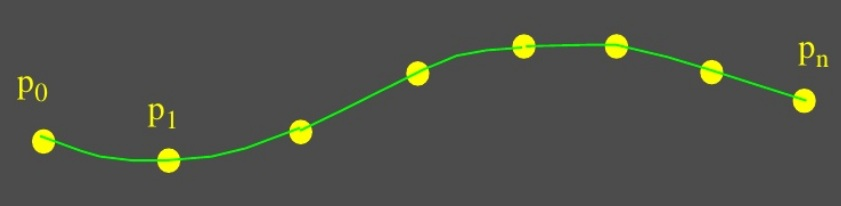<!-- .element: class="fragment" data-fragment-index="3"-->

	Si se tienen 
	$n+1$ 
	puntos de control : 

<!-- .element: class="fragment" data-fragment-index="4"-->

	$n$
	 secciones curvas a ajustar

<!-- .element: class="fragment" data-fragment-index="4"-->

	$4n$
	 coeficientes polinómicos (incógnitas)

<!-- .element: class="fragment" data-fragment-index="4"-->

	$4n-4$
	 ecuaciones ( las 2 secciones a cada lado de un punto de control deven tener la $1a$ y la $2a$ derivadas iguales: para 
	$n-1$
	puntos,
	$4$
	 ecuaciones por punto )

<!-- .element: class="fragment" data-fragment-index="4"-->

	Las posiciones 
	$p_0$
	 y 
	$p_n$
	 nos dan
	 $2$ 
	 ecuaciones mas

<!-- .element: class="fragment" data-fragment-index="4"-->

	Las otras 
	 $2$ 
	 ecuaciones se pueden establecer al definir como $0$ las segundas derivadas en 
	$p_0$
	 y 
	 $p_n$

<!-- .element: class="fragment" data-fragment-index="4"-->

## SPLINES CÚBICAS

<table width="600" heigth="500" border="0" align ="right">
<tr>
<td>

	$P($
	$u$
	$) = $
	
	$
	\begin{bmatrix}
	u^{3} & u^{2} & u & 1 \cr
	\end{bmatrix}
	$
	
	$\bullet$
	
	$
	\begin{bmatrix}
	a & b & c & d \cr
	\end{bmatrix}
	$
	
	$^{T} = $
	$ U $
	$\bullet $
	$M$
	$\bullet $
	$G$

 <!-- .element: class="fragment" data-fragment-index="2"-->

	 $P'($
	$u$
	$) = $
	
	$
	\begin{bmatrix}
	3u^{2} & 2u & 1 & 0 \cr
	\end{bmatrix}
	$
	
	$\bullet$
	
	$
	\begin{bmatrix}
	a & b & c & d \cr
	\end{bmatrix}
	$
	
	$^{T} = $
	$ U $
	$\bullet $
	$M$
	$\bullet $
	$G$

 <!-- .element: class="fragment" data-fragment-index="2"-->

	$\qquad  \qquad \qquad  \qquad \qquad  \qquad \qquad  \qquad 0 \leq$
	$u$
	$\leq1$

<!-- .element: class="fragment" data-fragment-index="2"-->

	 $ P($
	$0$
	$) = $
	$p_k$
	 $\qquad P($
	$1$
	$) = $
	$p_k$+$ \ _1$

<!-- .element: class="fragment" data-fragment-index="2"-->

	 $P'($
	$0$
	$) = $
	$Dp_k$
	 (Derivada en el punto 
	$p_k$
	 ) 
<!-- .element: class="fragment" data-fragment-index="2"-->

	 $P'($
	$1$
	$) = $
	$Dp_k$+$ \ _1$
	 (Derivada en el punto 
	$p_k$+$ \ _1$
	 )

<!-- .element: class="fragment" data-fragment-index="2"-->

	$\qquad \qquad  G_H \qquad \qquad  \qquad \qquad \qquad $ 
	$M_H$
	$\bullet $
	$G_H$
<!-- .element: class="fragment" data-fragment-index="2"-->

	$\qquad  \qquad \downarrow \qquad  \qquad \qquad  \qquad \qquad  \qquad  \qquad  \quad \downarrow$

<!-- .element: class="fragment" data-fragment-index="2"-->

	$
	\begin{bmatrix} 
	p_k \cr 
	p_k+1 \cr
	Dp_k \cr
	Dp_k+1 \cr
	\end{bmatrix}
	$

	$
	\quad = \quad  \begin{bmatrix}
	0 & 0 & 0 & 1 \cr
	1 & 1 & 1 & 1 \cr
	0 & 0 & 1 & 0 \cr
	4 & 2 & 1 & 0 \cr
	\end{bmatrix}
	$

	$
	\quad \begin{bmatrix} 
	a \cr 
	b \cr
	c \cr
	d \cr
	\end{bmatrix}
	$

<!-- .element: class="fragment" data-fragment-index="2"-->

</td>
</tr>
</table>
 

	Splines de Hermite

<!-- .element: class="fragment" data-fragment-index="1"-->

 

	Especificación con 
	condiciones de frontera: 

<!-- .element: class="fragment" data-fragment-index="1"-->

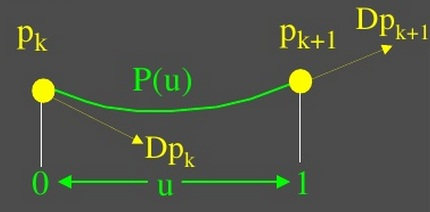<!-- .element: class="fragment" data-fragment-index="1"-->

	$p_k $ 
	 $= P($
	$0$
	$) = $
	$a$
	$+$
	$b$
	$+$
	$c$
	$+$
	$d$

<!-- .element: class="fragment" data-fragment-index="1"-->

	$p_k$+$ \ _1$
	 $= P($
	$1$
	$) = $
	$d$

<!-- .element: class="fragment" data-fragment-index="1"-->

	$Dp_k $ 
	 $= P'($
	$0$
	$) = $
	$c$

<!-- .element: class="fragment" data-fragment-index="1"-->

	$Dp_k$+$ \ _1$
	 $= P'($
	$1$
	$) = $
	$3a$
	$+$
	$2b$
	$+$
	$c$

<!-- .element: class="fragment" data-fragment-index="1"-->

## SPLINES CÚBICAS

<table width="550" heigth="50" border="0" align ="right">
<tr>
<td>

	 $P($
	$u$
	$) = $
	
	$
	\begin{bmatrix}
	u^{3} \ u^{2} \ u \ 1 \cr
	\end{bmatrix}
	$
	
	$\bullet$
	
	$
	\begin{bmatrix}
	a \ b \ c \ d \cr
	\end{bmatrix}
	$
	
	$^{T} = $
	$ U $
	$\bullet $
	$M$
	$\bullet $
	$G$

 <!-- .element: class="fragment" data-fragment-index="2"-->

	 $P'($
	$u$
	$) = $
	
	$
	\begin{bmatrix}
	3u^{2} \ 2u \ 1 \ 0 \cr
	\end{bmatrix}
	$
	
	$\bullet$
	
	$
	\begin{bmatrix}
	a \ b \ c \ d \cr
	\end{bmatrix}
	$
	
	$^{T} = $
	$ U $
	$\bullet $
	$M$
	$\bullet $
	$G$

 <!-- .element: class="fragment" data-fragment-index="2"-->

	$\ 0 \leq$
	$u$
	$\leq1$

<!-- .element: class="fragment" data-fragment-index="2"-->

	$P($
	$u$
	$)=$
	
	$
	\begin{bmatrix}
	u^{3} \ u^{2} \ u \ 1 \cr
	\end{bmatrix}
	$
	
	$\bullet$
	$M_H$
	$\bullet$
	
	$
	\begin{bmatrix} 
	p_k \cr 
	p_k+1 \cr
	Dp_k \cr
	Dp_k+1 \cr
	\end{bmatrix}
	$

<!-- .element: class="fragment" data-fragment-index="2"-->

</td>
</tr>
</table>

	Splines de Hermite

<!-- .element: class="fragment" data-fragment-index="1"-->

	$\qquad Matriz \ de \ Hermite$

<!-- .element: class="fragment" data-fragment-index="1"-->

	$ \qquad  \qquad \qquad \downarrow $ 

<!-- .element: class="fragment" data-fragment-index="1"-->

	
	$
	\begin{bmatrix} 
	a \cr 
	b \cr
	c \cr
	d \cr
	\end{bmatrix}
	$
	
	
	$
	=\begin{bmatrix}
	2 & -2 & 1 & 1 \cr
	-3 & 3 & -2 & -1 \cr
	0 & 0 & 1 & 0 \cr
	1 & 0 & 0 & 0 \cr
	\end{bmatrix}
	$
	
	
	$
	\begin{bmatrix} 
	p_k \cr 
	p_k+1 \cr
	Dp_k \cr
	Dp_k+1 \cr
	\end{bmatrix}
	$

<!-- .element: class="fragment" data-fragment-index="1"-->

 

	 $P'($
	$u$
	$) = \quad $
	$p_k$
	$(2$
	$u^{3}$
	$-3$
	$u^{2}$
	$+$
	$1$
	$)+$
	$p_k$+$ \ _1$
	$(-2$
	$u^{3}$
	$($
	$u^{2}$
	$+$
	$Dp_k$
	$($
	$u^{3}$
	$-2$
	$u^{2}$
	$+$
	$u$
	$)+$
	$Dp_k$+$ \ _1$
	$($
	$u^{3}$
	$-$
	$u^{2}$
	$)$

<!-- .element: class="fragment" data-fragment-index="3"-->

	 $\qquad \quad = \quad $
	$p_k$
	$H_0$
	$($
	$u$
	$)+$
	$p_k$+$ \ _1$
	$H_1$
	$($
	$u$
	$)$
	$+$
	$Dp_k$
	$H_2$
	$($
	$u$
	$)$
	$)+$
	$Dp_k$+$ \ _1$
	$H_3$
	$($
	$u$
	$)$

<!-- .element: class="fragment" data-fragment-index="3"-->
 
  

	Los polinomios 
	$\ H_i$
	$($
	$u$
	$)$ para 
	$\ k$
	$= 0,1,2,3$ son las funciones de combinación. 

<!-- .element: class="fragment" data-fragment-index="4"-->

## SPLINES CÚBICAS 

	Splines de Hermite / ejemplos / continuidad entre secciones

<!-- .element: class="fragment" data-fragment-index="1"-->

<table width="550" heigth="500" border="0" align ="right">
<tr>
<td>

  

	Continuidad entre curvas:

 <!-- .element: class="fragment" data-fragment-index="2"-->

 
 

	 $ \qquad \qquad \ Curva 1 \qquad \quad \ Curva 2$

 <!-- .element: class="fragment" data-fragment-index="3"-->

	
	$
	\begin{bmatrix} 
	P(0) \cr 
	P(1) \cr
	P'(0) \cr
	P'(1)\cr
	\end{bmatrix}
	$
	
	
	$\qquad
	\begin{bmatrix} 
	P(1) \cr 
	P(2) \cr
	k P'(1) \cr
	P'(2)\cr
	\end{bmatrix}
	$
	

<!-- .element: class="fragment" data-fragment-index="3"-->

	Si 
	$k$
	$ > 0 \rightarrow G^{1}$

<!-- .element: class="fragment" data-fragment-index="3"-->

	Si 
	$k$
	$ = 1 \rightarrow $
	$C^{1}$

<!-- .element: class="fragment" data-fragment-index="3"-->

</td>
</tr>
</table>

 

	$ \qquad $Familia de curvas:

 <!-- .element: class="fragment" data-fragment-index="2"-->

 
 
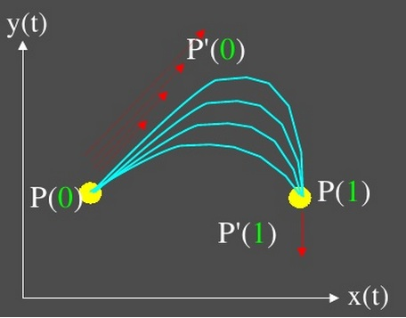<!-- .element: class="fragment" data-fragment-index="3"-->

## SPLINES CÚBICAS

	Superficies de Hermite

<!-- .element: class="fragment" data-fragment-index="1"-->

<table width="450" heigth="500" border="0" align ="right">
<tr>
<td>

$P($$s,u$$) = $$ S $$\bullet$$M $$\bullet$$G ($$u$$), $donde
$
G(u)=\begin{bmatrix} 
G_1(u)\cr 
G_2(u)\cr 
G_3(u)\cr 
G_4(u)\end{bmatrix}
$

<!-- .element: class="fragment" data-fragment-index="2"-->
 
 
 

El parche cúbico es una interpolación cúbica entre $p_k($$u$$) $ $= P($$0,u$$) \ $ y$\ P_k+1($$u$$)$ $= P(1$$,u$$)$ o, alternativamente, entre $\quad P( $$s,0$$)$ y $P($$s,1$$)$
<!-- .element: class="fragment" data-fragment-index="3"-->
</td>
</tr>
</table>

Desarrollando para la coordenada x:
<!-- .element: class="fragment" data-fragment-index="2"-->
 

$P($$s,u$$) = $$ S $$\bullet$$M_H $$\bullet$$G_Hx ($$u$$) $$=$$S$$\bullet$$M_H $$\bullet$
$
\begin{bmatrix} 
p_k(u)\cr
p_k+1(u)\cr 
Dp_k(u)\cr 
Dp_k+1(u)\end{bmatrix}
_X$

<!-- .element: class="fragment" data-fragment-index="2"-->
 
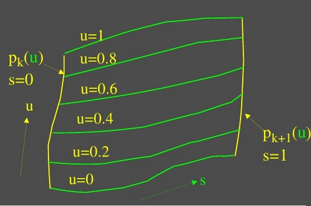<!-- .element: class="fragment" data-fragment-index="3"-->

## SPLINES CÚBICAS

Superficies de Hermite
<!-- .element: class="fragment" data-fragment-index="1"-->

<table width="350" heigth="500" border="0" align ="right">
<tr>
<td>

$P($$s,u$$)=$$S$$\bullet$$M$$\bullet$$G($$u$$)$ donde 
$
G(u)=\begin{bmatrix} 
G_1(u)\cr 
G_2(u)\cr 
G_3(u)\cr 
G_4(u)\end{bmatrix}
$

<!-- .element: class="fragment" data-fragment-index="1"-->
 
 

$P($$s,u$$) = $$ S $$\bullet$$M $$\bullet$$G' $$\bullet$$M^{T} $$\bullet$$ U' $$,$
<!-- .element: class="fragment" data-fragment-index="1"-->

$\ 0 \leq$$s$$,$$u$$\leq1$
<!-- .element: class="fragment" data-fragment-index="1"-->
 

$
G_Hx=\begin{bmatrix} 
g_11' & g_12' & g_13' & g_14'\cr 
g_21' & g_22' & g_23' & g_24'\cr
g_31' & g_22' & g_33' & g_34'\cr
g_41' & g_22' & g_43' & g_44'\cr
\end{bmatrix}
$

<!-- .element: class="fragment" data-fragment-index="1"-->
</td>
</tr>
</table>

Como:
<!-- .element: class="fragment" data-fragment-index="1"-->

$G_i ($$u$$) = $$ U $$\bullet$$M $$\bullet$$G_i' $ , donde $ G_i' $$ = $ $\begin{array} (( g_i1' \ g_i2' \ g_i3' \ g_i4' )\end{array}$$^{T}$
<!-- .element: class="fragment" data-fragment-index="1"-->

Entonces es el vector geométrico $G_i ($$u$$) $ se puede representar en la forma de hermite asi: 
<!-- .element: class="fragment" data-fragment-index="1"-->

$ \qquad \qquad \qquad \qquad s = 0 \qquad \qquad \qquad \qquad s = 1$
<!-- .element: class="fragment" data-fragment-index="1"-->

$P_kx ($$u$$) $$=$$U$$\bullet$$M_H $$\bullet$
$
\begin{bmatrix} 
g_11'\cr
g_12'\cr 
g_13'\cr 
g_11'\end{bmatrix}
_X$
$P_kx ($$u$$) $$=$$U$$\bullet$$M_H $$\bullet$
$
\begin{bmatrix} 
g_21'\cr
g_22'\cr 
g_23'\cr 
g_21'\end{bmatrix}
_X$

<!-- .element: class="fragment" data-fragment-index="1"-->
 

$DP_kx ($$u$$) $$=$$U$$\bullet$$M_H $$\bullet$
$
\begin{bmatrix} 
g_31'\cr
g_32'\cr 
g_33'\cr 
g_31'\end{bmatrix}
_X$
$DP_k+1x ($$u$$) $$=$$U$$\bullet$$M_H $$\bullet$
$
\begin{bmatrix} 
g_41'\cr
g_42'\cr 
g_43'\cr 
g_41'\end{bmatrix}
_X$

<!-- .element: class="fragment" data-fragment-index="1"-->

## SPLINES CÚBICAS

Superficies de Hermite
<!-- .element: class="fragment" data-fragment-index="1"-->

$
G_Hx=\begin{bmatrix} 
x(0,0) & x(0,1) & \dfrac{\partial}{\partial u} x(0,0) & \dfrac{\partial}{\partial u} x(0,1)\cr 
x(1,0) & x(1,1) & \dfrac{\partial}{\partial s} x(1,0) & \dfrac{\partial}{\partial s} x(1,1)\cr
\dfrac{\partial}{\partial s} x(0,0)  & \dfrac{\partial}{\partial s} x(0,1) & \dfrac{\partial^{2}}{\partial s \partial u} x(0,0) & \dfrac{\partial^{2}}{\partial s \partial u} x(0,1)\cr
\dfrac{\partial}{\partial s} x(1,0) &\dfrac{\partial}{\partial s} x(1,1) & \dfrac{\partial^{2}}{\partial s \partial u} x(1,0) & \dfrac{\partial^{2}}{\partial s \partial u} x(1,1)\cr
\end{bmatrix}
$

<!-- .element: class="fragment" data-fragment-index="1"-->

<table width="350" heigth="50" border="0" align ="right">
<tr>
<td>
 
 
 

$
G_Hx=\begin{bmatrix} 
g_11' & g_12' & g_13' & g_14'\cr 
g_21' & g_22' & g_23' & g_24'\cr
g_31' & g_22' & g_33' & g_34'\cr
g_41' & g_22' & g_43' & g_44'\cr
\end{bmatrix}
$

<!-- .element: class="fragment" data-fragment-index="1"-->
</td>
</tr>
</table>

<!-- .element: class="fragment" data-fragment-index="1"-->

## SPLINES CÚBICAS

Superficies de Hermite/Continuidad
<!-- .element: class="fragment" data-fragment-index="1"-->

$\qquad \qquad \qquad \qquad  Parche 1$$ \qquad \qquad \qquad \qquad \qquad $$Parche 2$
<!-- .element: class="fragment" data-fragment-index="1"-->

$
\begin{bmatrix} 
- & - & - & - \cr 
g_21' & g_22' & g_23' & g_24'\cr
- & - & - & - \cr 
g_41' & g_42' & g_43' & g_44'\cr
\end{bmatrix}$
$\quad
\begin{bmatrix} 
g_21' & g_22' & g_23' & g_24'\cr
- & - & - & - \cr
kg_41' & kg_42' & kg_43' & kg_44'\cr
- & - & - & - \cr
\end{bmatrix}$
<!-- .element: class="fragment" data-fragment-index="1"-->

Si $k$$ > 0 \rightarrow G^{1} \qquad \qquad$Si $k$$ = 1 \rightarrow $$C^{1}$
<!-- .element: class="fragment" data-fragment-index="1"-->
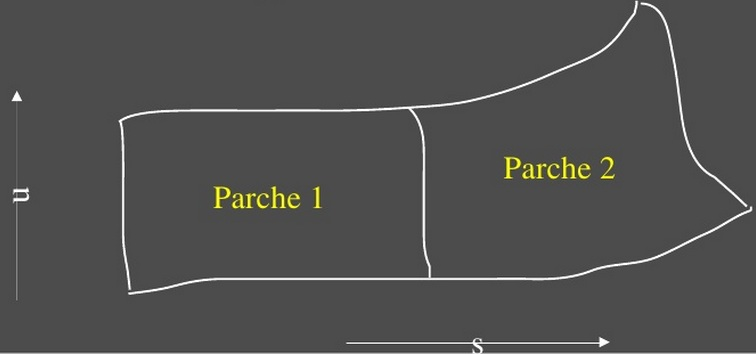<!-- .element: class="fragment" data-fragment-index="1"-->

## SPLINES CÚBICAS

<table width="550" heigth="50" border="0" align ="right">
<tr>
<td>

 $P($$u$$) = $
$
\begin{bmatrix}
u^{3} & u^{2} & u & 1 \cr
\end{bmatrix}
$
$\bullet$
$
\begin{bmatrix}
a & b & c & d \cr
\end{bmatrix}
$
$^{T} = $$ U $$\bullet $$M$$\bullet $$G$
 <!-- .element: class="fragment" data-fragment-index="1"-->

 $P'($$u$$) = $
$
\begin{bmatrix}
3u^{2} & 2u & 1 & 0 \cr
\end{bmatrix}
$
$\bullet$
$
\begin{bmatrix}
a & b & c & d \cr
\end{bmatrix}
$
$^{T} = $$ U $$\bullet $$M$$\bullet $$G$
 <!-- .element: class="fragment" data-fragment-index="1"-->

$ 0 \leq$$u$$\leq1$
<!-- .element: class="fragment" data-fragment-index="1"-->

 $\qquad P($$0$$) = $$p_k$
<!-- .element: class="fragment" data-fragment-index="1"-->

 $\qquad P($$1$$) = $$p_k+1$
<!-- .element: class="fragment" data-fragment-index="1"-->

 $\qquad P'($$0$$) = 1/2 (1-$$t$$) $$p_k+1$$ - $$p_k-1$
<!-- .element: class="fragment" data-fragment-index="1"-->

 $\qquad P'($$1$$) = 1/2 (1-$$t$$) $$p_k+2$$ - $$p_k$
<!-- .element: class="fragment" data-fragment-index="1"-->

$\quad \ $donde $ t $ es el  parámetro de tensión
<!-- .element: class="fragment" data-fragment-index="1"-->
</td>
</tr>
</table>

Splines Cardinales
<!-- .element: class="fragment" data-fragment-index="1"-->
 
 

Especificación con  condiciones de frontera:
<!-- .element: class="fragment" data-fragment-index="1"-->
 
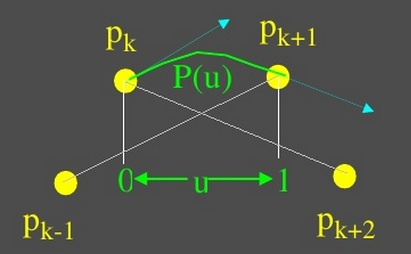<!-- .element: class="fragment" data-fragment-index="1"-->

## SPLINES CÚBICAS

<table width="550" heigth="50" border="0" align ="right">
<tr>
<td>

 $P($$u$$) = $
$
\begin{bmatrix}
u^{3} & u^{2} & u & 1 \cr
\end{bmatrix}
$
$\bullet$
$
\begin{bmatrix}
a & b & c & d \cr
\end{bmatrix}
$
$^{T} = $$ U $$\bullet $$M$$\bullet $$G$
 <!-- .element: class="fragment" data-fragment-index="1"-->

 $P'($$u$$) = $
$
\begin{bmatrix}
3u^{2} & 2u & 1 & 0 \cr
\end{bmatrix}
$
$\bullet$
$
\begin{bmatrix}
a & b & c & d \cr
\end{bmatrix}
$
$^{T} = $$ U $$\bullet $$M$$\bullet $$G$
 <!-- .element: class="fragment" data-fragment-index="1"-->

$ 0 \leq$$u$$\leq1$
<!-- .element: class="fragment" data-fragment-index="1"-->
 

$\quad
M_c =\begin{bmatrix} 
-s' & 2-s & s-2 & s\cr
2s & s-3 & 3-2s & -s \cr
-s & 0 & s & 0\cr
0 & 1 & 0 & 0 \cr
\end{bmatrix}$ $ \qquad \qquad $ Donde  $ s $ $= ( 1 -$  $ t $$ ) / 2$ 
<!-- .element: class="fragment" data-fragment-index="1"-->
</td>
</tr>
</table>

Splines Cardinales
<!-- .element: class="fragment" data-fragment-index="1"-->
 
 
 
 

$P($$u$$) =$$\begin{bmatrix} u^{3} & u^{2} & u & 1 \end{bmatrix}$$\bullet$$M_C $$\bullet$
$
\begin{bmatrix} 
p_k-1\cr
p_k\cr 
p_k+1\cr 
p_k+2\end{bmatrix}
$
<!-- .element: class="fragment" data-fragment-index="1"-->
 
 

$P($$u$$)=$$p_k-1$$(-$$s$$u^{3}$$+2$$s$$u$$-$$s$$u$$)+$$p_k$$[(2-$$s$$)$$u^{3}$$+($$s$$-3)$$u^{2}$$+1]$
<!-- .element: class="fragment" data-fragment-index="1"-->

$\qquad \ +$$p_k+1$$[($$s$$-2)$$u^{3}$$+(3-2$$s$$)$$u^{2}$$+$$s$$u$$]+$$p_k+2$$($$s$$u^{3}$$-$$s$$u^{2}$$)$
<!-- .element: class="fragment" data-fragment-index="1"-->

$\qquad \ =$$p_k-1$$CAR_0$$($$u$$)+$$p_k$$CAR_1$$($$u$$)+$$p_k+1$$CAR_2$$($$u$$)+$$p_k+2$$CAR_3$$($$u$$)+$
<!-- .element: class="fragment" data-fragment-index="1"-->

$\quad $ Los polinomios $CAR_k$$($$u$$) $ para $k$ $= 0,1,2,3$ son las $funciones \ de \ combinación.$
<!-- .element: class="fragment" data-fragment-index="1"-->

##SPLINE CÚBICAS
<table width="550" heigth="50" border="0" align ="right">
<tr>
<td>

 $P($$u$$) = $
$
\begin{bmatrix}
u^{3} & u^{2} & u & 1 \cr
\end{bmatrix}
$
$\bullet$
$
\begin{bmatrix}
a & b & c & d \cr
\end{bmatrix}
$
$^{T} = $$ U $$\bullet $$M$$\bullet $$G$
 <!-- .element: class="fragment" data-fragment-index="1"-->

 $P'($$u$$) = $
$
\begin{bmatrix}
3u^{2} & 2u & 1 & 0 \cr
\end{bmatrix}
$
$\bullet$
$
\begin{bmatrix}
a & b & c & d \cr
\end{bmatrix}
$
$^{T} = $$ U $$\bullet $$M$$\bullet $$G$
 <!-- .element: class="fragment" data-fragment-index="1"-->

$ 0 \leq$$u$$\leq1$
<!-- .element: class="fragment" data-fragment-index="1"-->
</td>
</tr>
</table>

Splines Kochanek-Bartels
<!-- .element: class="fragment" data-fragment-index="1"-->
 

Especificación con  condiciones de frontera:
<!-- .element: class="fragment" data-fragment-index="1"-->

$P($$0$$)=$$p_k$
<!-- .element: class="fragment" data-fragment-index="1"-->

$P($$1$$)=$$p_k+1$
<!-- .element: class="fragment" data-fragment-index="1"-->

$P'($$0$$)= 1/2(1-$$t$$)[(1+$$b$$)(1-$$c$$)($$p_k$$-$$p_k-1$$)+(1-$$b$$)(1+$$c$$)($$p_k+1$$-$$p_k$$)]$
<!-- .element: class="fragment" data-fragment-index="1"-->

$P'($$1$$)= 1/2(1-$$t$$)[(1+$$b$$)(1+$$c$$)($$p_k+1$$-$$p_k$$)+(1-$$b$$)(1-$$c$$)($$p_k+2$$-$$p_k+1$$)]$
<!-- .element: class="fragment" data-fragment-index="1"-->

donde:
<!-- .element: class="fragment" data-fragment-index="1"-->

$t $ es el parámetro de tensión
<!-- .element: class="fragment" data-fragment-index="1"-->

$b $ es el parámetro de sesgo : controla la distancia que cada curva se inclina en cada sección.
<!-- .element: class="fragment" data-fragment-index="1"-->

$t $ es el parámetro de tensión : Del vector tangente a lo largo de las fronteras de las secciones.
<!-- .element: class="fragment" data-fragment-index="1"-->

## CURVAS Y SUPERFICIES DE BEZIER
 
 

	1. Curvas de Pierre Bezier

<!-- .element: class="fragment" data-fragment-index="1"-->
 

	2. Propiedades

<!-- .element: class="fragment" data-fragment-index="2"-->
 

	3. Técnicas de Diseño de Curvas de Bezier

<!-- .element: class="fragment" data-fragment-index="3"-->
 

	4. Curvas Cúbicas de Bezier

<!-- .element: class="fragment" data-fragment-index="4"-->
 

	5. Superficies de Bezier

<!-- .element: class="fragment" data-fragment-index="5"-->

## CURVAS Y SUPERFICIES DE BEZIER

	1. Curvas de Pierre Bezier

<!-- .element: class="fragment" data-fragment-index="1"-->

	 $P($
	$u$
	$)=(x($
	$u$
	$),y($
	$u$
	$),z($
	$u$
	$)^{T} \qquad \qquad \qquad \qquad \qquad \qquad \qquad \qquad $ Tenemos $ n+1 $ 
	 puntos de control 
	 de coordenadas 
<!-- .element: class="fragment" data-fragment-index="1"-->

	$0 \leq$
	$u$
	$\leq$
	$1$
	$\qquad \qquad \qquad \qquad \qquad \qquad \qquad \qquad \qquad \qquad \qquad \qquad \quad $ 
	$ p_k $
	(
	$x_k$
	,
	$y_k$
	,
	$ z_k$
	),
	$ \quad \ \qquad $ 
	$k$
	$=0,1,2,...,n$

<!-- .element: class="fragment" data-fragment-index="1"-->

	Especificación con 
	 funciones de combinación:

<!-- .element: class="fragment" data-fragment-index="1"-->

	 $P($
	$u$
	$)= \sum $
	$u$
	$p_k$ 
	$BEZ_k,n($
	$u$
	$)$
	$, k=0,1,2,...,n$
	$ \longrightarrow$
	$BEZ_k,n($
	$u$
	$)$
	$=$
	$C($ 
	$n,k$
	$)$ 
	$u$
	$^{k}(1-$
	$u$
	$)^{n-k}$

<!-- .element: class="fragment" data-fragment-index="1"-->

	$\qquad \qquad 0$
	$\leq$
	$u$
	$\leq$
	$1$
	$ \qquad \qquad \qquad \qquad \qquad \qquad \qquad \quad $ 
	$\downarrow$

<!-- .element: class="fragment" data-fragment-index="1"-->

	$\downarrow \qquad $
	$BEZ_k,n($
	$u$
	$)$
	$=( 1-$
	$u$
	$)$
	$BEZ_k,n-1($
	$u$
	$)$
	$+$
	$u$
	$BEZ_k-1,n-1($
	$u$
	$)$

<!-- .element: class="fragment" data-fragment-index="1"-->

	 $x($
	$u$
	$)= \sum $
	$u$
	$x_k$ 
	$BEZ_k,n($
	$u$
	$)$
	$, k=0,1,2,...,n  \qquad $
	$BEZ_k,k($
	$u$
	$)$
	$=$
	$u$
	$^{k} \quad $
	$BEZ_0,k($
	$u$
	$)$
	$=(1-$
	$u$
	$)^{k}$

<!-- .element: class="fragment" data-fragment-index="1"-->

	 $y($
	$u$
	$)= \sum $
	$u$
	$y_k$ 
	$BEZ_k,n($
	$u$
	$)$
	$, k=0,1,2,...,n \qquad \qquad \qquad $
	$C($ 
	$n,k$
	$)$ 
	$=n!/(k!(n-k)!)$

<!-- .element: class="fragment" data-fragment-index="1"-->

	 $z($
	$u$
	$)= \sum $
	$u$
	$z_k$ 
	$BEZ_k,n($
	$u$
	$)$
	$, k=0,1,2,...,n \qquad \qquad \qquad \qquad \qquad$
	$\downarrow $

<!-- .element: class="fragment" data-fragment-index="1"-->

	$ \qquad \qquad 0$
	$\leq$
	$u$
	$\leq$
	$1 \qquad \qquad \qquad \qquad \qquad $
	$C($ 
	$n,k$
	$)$ 
	$=$
	$C($ 
	$n,k-1$
	$)$ 
	$(n-k+1)/k \ n>k$

<!-- .element: class="fragment" data-fragment-index="1"-->

## CURVAS Y SUPERFICIES DE BEZIER

<table width="550" heigth="50" border="0" align ="right">
<tr>
<td>

	Tenemos $ n+1 $ 
	 puntos de control 
	 de coordenadas:
	$\quad p_k $
	(
	$x_k$
	,
	$y_k$
	,
	$ z_k$
	),
	$ \quad \ \qquad $ 
	$k$
	$=0,1,2,...,n$

<!-- .element: class="fragment" data-fragment-index="1"-->
</tr>
</td>
</table>

<table width="350" heigth="30" border="0" align ="left">
<tr>
<td>

	 $P($
	$u$
	$)= \sum $
	$u$
	$p_k$ 
	$BEZ_k,n($
	$u$
	$)$
	$,$
	$k=0,1,2,..,n$
	$ \quad 0$
	$\leq$
	$u$
	$\leq$
	$1$

<!-- .element: class="fragment" data-fragment-index="1"-->
</tr>
</td>
</table>

 
 
 

	Propiedades

<!-- .element: class="fragment" data-fragment-index="1"-->

	1. Una curva de Bezier es un polinomio de grado n (uno menos que el número de puntos de control)

<!-- .element: class="fragment" data-fragment-index="1"-->

	2. La curva siempre pasa a través del primer y último puntos de control

<!-- .element: class="fragment" data-fragment-index="1"-->

	$P($
	$0$
	$)=$
	$p_0 \qquad \qquad $ 
	$P($
	$1$
	$)=$
	$p_n$ 

<!-- .element: class="fragment" data-fragment-index="1"-->

	3. Asimismo
	$ \quad \quad P'($
	$0$
	$)=-n$
	$p_0$
	$+n$
	$p_1$
	$\quad \quad \ \ P($
	$1$
	$)=$
	$p_n$ 

<!-- .element: class="fragment" data-fragment-index="1"-->

	Es decir, la tangente de la curva en el extremo está a lo largo de la línea que une ese extremo al punto de control adyacente.

<!-- .element: class="fragment" data-fragment-index="1"-->

	4. También: $\qquad \sum$
	$BEZ_k,n($
	$u$
	$)$
	$=1 \qquad k=0,1,2,...,n$

<!-- .element: class="fragment" data-fragment-index="1"-->

	De esto se tiene que la curva de Bezier cae dentro del casco convexo de los puntos de control.

<!-- .element: class="fragment" data-fragment-index="1"-->

## CURVAS Y SUPERFICIES DE BEZIER

	Técnicas de Diseño de Curvas de Bezier

<!-- .element: class="fragment" data-fragment-index="1"-->

<table width="550" heigth="50" border="0" align ="right">
<tr>
<td>

	Tenemos $ n+1 $ 
	 puntos de control 
	 de coordenadas:
	$\quad p_k $
	(
	$x_k$
	,
	$y_k$
	,
	$ z_k$
	),
	$ \quad \ \qquad $ 
	$k$
	$=0,1,2,...,n$

<!-- .element: class="fragment" data-fragment-index="1"-->
</tr>
</td>
</table>

<table width="350" heigth="30" border="0" align ="left">
<tr>
<td>

	 $P($
	$u$
	$)= \sum $
	$u$
	$p_k$ 
	$BEZ_k,n($
	$u$
	$)$
	$,$
	$k=0,1,2,..,n$
	$ \quad 0$
	$\leq$
	$u$
	$\leq$
	$1$

<!-- .element: class="fragment" data-fragment-index="1"-->
</tr>
</td>
</table>

 
 
 

	1. Las curvas cerradas se pueden generar al especificar el primer y ultimo punto de control en la misma posición.

<!-- .element: class="fragment" data-fragment-index="1"-->

 

	2. Al especificar múltiples puntos de control en la misma posición se obtiene mas peso para la posición.

<!-- .element: class="fragment" data-fragment-index="1"-->

 

	1. 
	Propiedad 3
	: La tangente  de la curva en el extremo está a lo largo de la línea que une ese extremo al punto de control adyacente.

<!-- .element: class="fragment" data-fragment-index="1"-->

## CURVAS Y SUPERFICIES DE BEZIER

	Técnicas de Diseño de Curvas de Bezier: 
	Empalme de 2 secciones

<!-- .element: class="fragment" data-fragment-index="1"-->

 

	Propiedad 3
	: La tangente  de la curva en el extremo está a lo largo de la línea que une ese extremo al punto de control adyacente.

<!-- .element: class="fragment" data-fragment-index="1"-->

	Ejemplo para continuidad
	: $ G^{0}$
	$, $
	$ G^{1}$
	$, $
	$ C^{1}$

<!-- .element: class="fragment" data-fragment-index="1"-->

 
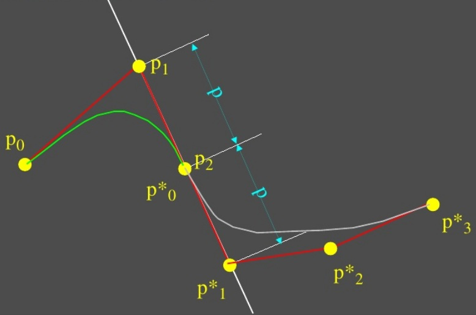<!-- .element: class="fragment" data-fragment-index="1"-->

## CURVAS Y SUPERFICIES DE BEZIER

	Curvas Cúbicas de Bezier

<!-- .element: class="fragment" data-fragment-index="1"-->

<table width="550" heigth="50" border="0" align ="right">
<tr>
<td>

	Tenemos $ n+1 $ 
	 puntos de control 
	 de coordenadas:
	$\quad p_k $
	(
	$x_k$
	,
	$y_k$
	,
	$ z_k$
	),
	$ \quad \ \qquad $ 
	$k$
	$=0,1,2,...,n$

<!-- .element: class="fragment" data-fragment-index="1"-->

	$BEZ_0,3($
	$u$
	$)$
	$=(1-$
	$u$
	$)^{3}$

<!-- .element: class="fragment" data-fragment-index="1"-->

	$BEZ_1,3($
	$u$
	$)$
	$=3$
	$u$
	$(1-$
	$u$
	$)^{2}$

<!-- .element: class="fragment" data-fragment-index="1"-->

	$BEZ_2,3($
	$u$
	$)$
	$=3$
	$u$
	$^{2}(1-$
	$u$
	$)$

<!-- .element: class="fragment" data-fragment-index="1"-->

	$BEZ_3,3($
	$u$
	$)$
	$=3$
	$u$
	$^{3}$

<!-- .element: class="fragment" data-fragment-index="1"-->
</tr>
</td>
</table>

<table width="350" heigth="30" border="0" align ="left">
<tr>
<td>

	 $P($
	$u$
	$)= \sum $
	$u$
	$p_k$ 
	$BEZ_k,n($
	$u$
	$)$
	$,$
	$k=0,1,2,..,n$
	$ \quad 0$
	$\leq$
	$u$
	$\leq$
	$1$

<!-- .element: class="fragment" data-fragment-index="1"-->
</tr>
</td>
</table>

 
 
 
 

	Especificación con 
	 funciones de combinación: 

<!-- .element: class="fragment" data-fragment-index="1"-->

 

	Especificación con 
	 matríz característica: 

<!-- .element: class="fragment" data-fragment-index="1"-->

	$P($
	$u$
	$)=$
	$
		\begin{bmatrix}
		u^{3} & u^{2} & u & 1 \cr
		\end{bmatrix}
		$
	$\bullet $
	$M_Bez$
	$\bullet $
	$
		\begin{bmatrix}
		p_0 \cr
		p_1 \cr
		p_2 \cr
		p_3 \cr
		\end{bmatrix}
		$
	$\qquad M_Bez$
	$
		=\begin{bmatrix}
		-1 & 3 & -3 & 1 \cr
		3 & -6 & 3 & 0 \cr
		-3 & 3 & 0 & 0 \cr
		1 & 0 & 0 & 0 \cr
		\end{bmatrix}
		$

<!-- .element: class="fragment" data-fragment-index="1"-->

## CURVAS Y SUPERFICIES DE BEZIER

 

	Superficies de Bezier

<!-- .element: class="fragment" data-fragment-index="1"-->

 
 
 

	$x($
	$s,u$
	$)=$
	$S$
	$\bullet $
	$M_B$
	$\bullet $
	$G_Bx'$
	$\bullet $
	$M_B ^{T}$
	$U^{T}$

<!-- .element: class="fragment" data-fragment-index="1"-->

	$y($
	$s,u$
	$)=$
	$S$
	$\bullet $
	$M_B$
	$\bullet $
	$G_By'$
	$\bullet $
	$M_B^{T}$
	$U^{T}$

<!-- .element: class="fragment" data-fragment-index="1"-->

	$z($
	$s,u$
	$)=$
	$S$
	$\bullet $
	$M_B$
	$\bullet $
	$G_Bz'$
	$\bullet $
	$M_B ^{T}$
	$U^{T}$

<!-- .element: class="fragment" data-fragment-index="1"-->

## CURVAS Y SUPERFICIES DE B-SPLINE

 

	1. Curvas de B-Spline

<!-- .element: class="fragment" data-fragment-index="1"-->

 

	2. Uniformes y Periódicas

<!-- .element: class="fragment" data-fragment-index="2"-->

 

	3. Cúbicas y Periódicas

<!-- .element: class="fragment" data-fragment-index="3"-->

 

	4. Uniformes y Abiertas

<!-- .element: class="fragment" data-fragment-index="4"-->

 

	5. No Uniformes

<!-- .element: class="fragment" data-fragment-index="5"-->

 

	6. Superficies de B-Spline

<!-- .element: class="fragment" data-fragment-index="6"-->

## CURVAS Y SUPERFICIES DE B-SPLINE

	1. Curvas de B-Spline

<!-- .element: class="fragment" data-fragment-index="1"-->

	Ventajas respecto a las curvas de Bezier: $ \ $
	 1. El grado del polinomio se puede determinar independientemente del número de puntos de control.

<!-- .element: class="fragment" data-fragment-index="1"-->

	 2. Permiten control local $ \ $
	 Desventaja $ \ $
	 1. Complejidad.

<!-- .element: class="fragment" data-fragment-index="1"-->

<table width="550" heigth="50" border="0" align ="right">
<tr>
<td>

	Tenemos $ n+1 $ 
	 puntos de control 
	 de coordenadas:
	$\quad p_k $
	(
	$x_k$
	,
	$y_k$
	,
	$ z_k$
	),
	$ \quad \ \qquad $ 
	$k$
	$=0,1,2,...,n$

<!-- .element: class="fragment" data-fragment-index="1"-->
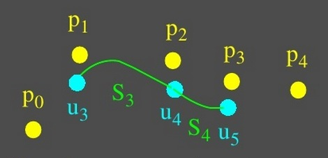<!-- .element: class="fragment" data-fragment-index="1"-->
 
 
 
 
 
 

	$S_3 \ $
	 es definida por 
	$p_0,p_1,p_2,p_3$

<!-- .element: class="fragment" data-fragment-index="1"-->

	$S_4 \ $
	 es definida por 
	$p_1,p_2,p_3,p_4$

<!-- .element: class="fragment" data-fragment-index="1"-->
</tr>
</td>
</table>

<table width="400" heigth="30" border="0" align ="left">
<tr>
<td>

	Definición $ \ $
	 $P($
	$u$
	$)= \sum $
	$p_k$ 
	$B_k,d($
	$u$
	$)$
	$,$
	$\qquad \qquad \qquad \qquad k=0,1,2,..,n$
	$\qquad \qquad \qquad \ 2 \leq$
	$d$
	$\leq n+1 \ $
	 valor fijo
	$\qquad \qquad \qquad \quad u_min \leq$
	$u$
	$\leq u_max$	

<!-- .element: class="fragment" data-fragment-index="1"-->

	Ejemplo
	$ \qquad n=4 \qquad \qquad$
	$d$
	$=4$

<!-- .element: class="fragment" data-fragment-index="1"-->

	Vector de nudo 
	 de $n+$
	$d$
	$+1 (9) $ pos:

<!-- .element: class="fragment" data-fragment-index="1"-->

	$ \swarrow \qquad \searrow $

<!-- .element: class="fragment" data-fragment-index="1"-->

	$u_min \qquad \qquad \qquad u_max$

<!-- .element: class="fragment" data-fragment-index="1"-->

</tr>
</td>
</table>

## CURVAS Y SUPERFICIES DE B-SPLINE

	1. Curvas de B-Spline

<!-- .element: class="fragment" data-fragment-index="1"-->

	 $P($
	$u$
	$)=(x($
	$u$
	$),y($
	$u$
	$),z($
	$u$
	$)^{T} \qquad \qquad \qquad \qquad \qquad \qquad $ Tenemos $ n+1 $ 
	 puntos de control 
	 de coordenadas 
<!-- .element: class="fragment" data-fragment-index="1"-->

	$0 \leq$
	$u$
	$\leq$
	$1$
	$ \qquad \qquad \qquad \qquad \qquad \qquad \qquad \qquad \qquad \quad $ 
	$ p_k $
	(
	$x_k$
	,
	$y_k$
	,
	$ z_k$
	),
	$ \quad \ \qquad $ 
	$k$
	$=0,1,2,...,n$

<!-- .element: class="fragment" data-fragment-index="1"-->

	Especificación con 
	 funciones de combinación (Cox-deBoor):

<!-- .element: class="fragment" data-fragment-index="1"-->

	 $P($
	$u$
	$)= \sum $
	$p_k$ 
	$B_k,d($
	$u$
	$)$
	$, k=0,1,2,...,n$
	$ \searrow$

<!-- .element: class="fragment" data-fragment-index="1"-->

	$u_min$
	$ \leq $
	$u$
	$ \leq $
	$u_max \qquad \qquad $
	$B_k,d($
	$u$
	$)$
	$=($
	$u$
	$-$
	$u_k$ 
	$)/($
	$u_k+d-1$ 
	$-$
	$u_k$ 
	$)$
	$B_k,d-1($
	$u$
	$)$

<!-- .element: class="fragment" data-fragment-index="1"-->

	$+($
	$u_k+d$ 
	$-$
	$u$
	$)/($
	$u_k+d$ 
	$-$
	$u_k+1$ 
	$)$
	$B_k+1,d-1($
	$u$
	$)$

<!-- .element: class="fragment" data-fragment-index="1"-->

<table width="400" heigth="50" border="0" align ="right">
<tr>
<td>

	$ \downarrow $

<!-- .element: class="fragment" data-fragment-index="1"-->

	$B_k,d($
	$u$
	$)$
	$= \quad 1, $
	 si $ \ $
	$u_k$ 
	$ \leq $
	$u$
	$ \leq $
	$u_k+1$ 

<!-- .element: class="fragment" data-fragment-index="1"-->

	$ \qquad $
	$0,$ 
	 de otro modo 

<!-- .element: class="fragment" data-fragment-index="1"-->
</tr>
</td>
</table>

<table width="400" heigth="50" border="0" align ="left">
<tr>
<td>

	 $x($
	$u$
	$)= \sum $
	$u$
	$x_k$ 
	$B_k,d($
	$u$
	$)$
	$, k=0,1,2,...,n$ 

<!-- .element: class="fragment" data-fragment-index="1"-->

	 $y($
	$u$
	$)= \sum $
	$u$
	$y_k$ 
	$B_k,d($
	$u$
	$)$
	$, k=0,1,2,...,n$ 

<!-- .element: class="fragment" data-fragment-index="1"-->

	 $z($
	$u$
	$)= \sum $
	$u$
	$z_k$ 
	$B_k,d($
	$u$
	$)$
	$, k=0,1,2,...,n$ 

<!-- .element: class="fragment" data-fragment-index="1"-->

	$u_m$$_i$$_n$
	$ \leq $
	$u$
	$ \leq $
	$u_m$$_a$$_x$

<!-- .element: class="fragment" data-fragment-index="1"-->
</tr>
</td>
</table>

## CURVAS Y SUPERFICIES DE B-SPLINE

 

	Propiedades

<!-- .element: class="fragment" data-fragment-index="1"-->

 

	1. La curva resultante es un polinomio de grado 
	$ \ d $
	$-1 $ y continuidad $C$
	$^{d}$
	$^{-2}$

<!-- .element: class="fragment" data-fragment-index="1"-->

	2.$ \ n+1 \ $puntos de control y
	funciones de combinación

<!-- .element: class="fragment" data-fragment-index="1"-->

	3. Cada 
	funcion de combinación $ \ B_k$, $_d$
	$($
	$u$
	$) \ $
	 se define sobre 
	$ \ d \ $
	 subintervalos del rango total de 
	$ \ u \ $
	 , empezando con el valor de
	 nudo $ \ u_k$ 

<!-- .element: class="fragment" data-fragment-index="1"-->

	4. El rango del parámetro 
	$ \ u \ $
	 se divide en $ \ n+$
	$d \ $
	 subintervalos entre los valores $\ n+$
	$d$
	$+1 \ $ que se especifican en el vector de nudo

<!-- .element: class="fragment" data-fragment-index="1"-->

	5. Con el 
	vector de nudo 
	 de $\ n+ \ $
	$d$
	$+1 \ pos: $
	$\begin{Bmatrix} u_0, \ u_1, \ ...,u_n+d \cr \end{Bmatrix} \ $
	 la curva que resulta se define únicamente en el intervalo que va desde el valor de nudo 
	$ \ u_d$$- $$_1(=u_m$$_i$$_n) \ $
	 hasta el valor 
	$ \ u_n$$+ $$_1(=u_m$$_a$$_x). \ $
	 Es decir, se tienen $: \ n-$
	$d$
	$+2 \ $ secciones de curva.

<!-- .element: class="fragment" data-fragment-index="1"-->

## CURVAS Y SUPERFICIES DE B-SPLINE

 

	Propiedades

<!-- .element: class="fragment" data-fragment-index="1"-->
 
 

	6. Cada sección de curva $ \ ($ entre 
	 2 valores de nudo 
	 sucesivos $ \ )$ está influenciada por 
	$ \ d \ $
	 puntos de control

<!-- .element: class="fragment" data-fragment-index="1"-->

	7. La mayoría de los puntos de control afecta 
	$ \ d \ $
	 secciones de curva

<!-- .element: class="fragment" data-fragment-index="1"-->

	8. Para cualquier valor de 
	$ \ u \ $
	 en el intervalo desde 
	$ \ u_d$$+ $$_1 \ $
	 hasta 
	$ \ u_n$$+ $$_1 \ $
	 se tiene: 

<!-- .element: class="fragment" data-fragment-index="1"-->

	$B_k$$, $$d($
	$u$
	$)$
	$=1, \ $ para  
	$ \ k$
	$=0 \ $ hasta $ \ n$  

<!-- .element: class="fragment" data-fragment-index="1"-->

## CURVAS Y SUPERFICIES DE B-SPLINE

 

	Especificación

<!-- .element: class="fragment" data-fragment-index="1"-->
 
 
 

	1) Puntos de Control

<!-- .element: class="fragment" data-fragment-index="1"-->

	2) Funciones de Combinación

<!-- .element: class="fragment" data-fragment-index="1"-->

	$ \qquad \qquad \quad  \ $ -
	$ \ d$

<!-- .element: class="fragment" data-fragment-index="1"-->

	-
	 Vector de Nudo

<!-- .element: class="fragment" data-fragment-index="1"-->

## CURVAS Y SUPERFICIES DE B-SPLINE

	Uniformes y Periódicas / 
	 Definición, Propiedades y Ejemplo

<!-- .element: class="fragment" data-fragment-index="1"-->

	 Definición:

<!-- .element: class="fragment" data-fragment-index="1"-->

	El espaciado entre los 
	 valores de nudo 
	 es constante.

<!-- .element: class="fragment" data-fragment-index="1"-->
 

	 Propiedades:

<!-- .element: class="fragment" data-fragment-index="1"-->

	1. Posee 
	 funciones 
	 periódicas 
	 de combinación 

<!-- .element: class="fragment" data-fragment-index="1"-->

	2. 
	$ \ B_k$$, $$_d($
	$u$
	$)$
	$=$ 
	$B_k$$+$$_1$$, $$_d($
	$u$
	$+$ 
	$ \nabla u$
	$)$
	$+$ 
	$B_k$$+$$_2$$, $$_d($
	$u$
	$+2$ 
	$ \nabla u$
	$)$
	$,$

<!-- .element: class="fragment" data-fragment-index="1"-->

	donde 
	$ \nabla u \ $
	 es la distancia entre valores de nudo adyacentes 

<!-- .element: class="fragment" data-fragment-index="1"-->
 

	 Ejemplo:

<!-- .element: class="fragment" data-fragment-index="1"-->
 

	$n=$
	$d$
	$=3 \ $
	 y 
	$\begin{Bmatrix} 0, \ 1, \ 2, \ 3, \ 4, \ 5, \ 6 \cr \end{Bmatrix} \ $
	$,\ $ se tienen las stes.: $ \ $
	 funciones de combinación 

<!-- .element: class="fragment" data-fragment-index="1"-->

## CURVAS Y SUPERFICIES DE B-SPLINE

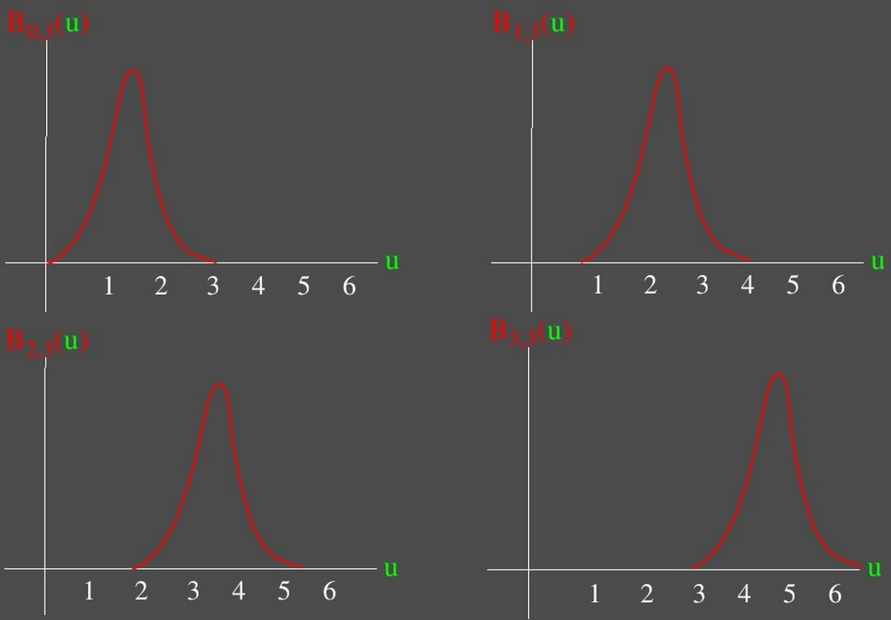<!-- .element: class="fragment" data-fragment-index="1"-->

## CURVAS Y SUPERFICIES DE B-SPLINE

 

	Cúbicas y Periódicas

<!-- .element: class="fragment" data-fragment-index="1"-->

	Para $ \ $
	$d$
	$=4 \ $ y $ \ n=3 $ se tiene el siguiente 
	 vector de nudo:

<!-- .element: class="fragment" data-fragment-index="1"-->

	$\begin{Bmatrix} 0, \ 1, \ 2, \ 3, \ 4, \ 5, \ 6, \ 7 \cr \end{Bmatrix} \ $
	 y podemos calcular las 
	 funciones de combinación 

<!-- .element: class="fragment" data-fragment-index="1"-->

 

	Tambien, se pueden especificar mediante 
	 condiciones de frontera:

<!-- .element: class="fragment" data-fragment-index="1"-->

 
<table width="400" heigth="50" border="0" align ="right">
<tr>
<td>

	$P($
	$0$
	$)=1/6($
	$p_0$
	$+4$
	$p_1$
	$+$
	$p_2$
	$)$

<!-- .element: class="fragment" data-fragment-index="1"-->

	$P($
	$1$
	$)=1/6($
	$p_1$
	$+4$
	$p_2$
	$+$
	$p_3$
	$)$

<!-- .element: class="fragment" data-fragment-index="1"-->

	$P'($
	$0$
	$)=1/2($
	$p_2$
	$-$
	$p_0$
	$)$

<!-- .element: class="fragment" data-fragment-index="1"-->

	$P'($
	$1$
	$)=1/2($
	$p_3$
	$-$
	$p_1$
	$)$

<!-- .element: class="fragment" data-fragment-index="1"-->
</tr>
</td>
</table>

 
<table width="550" heigth="50" border="0" align ="left">
<tr>
<td>

	 $P($
	$u$
	$) = $
	
		$
		\begin{bmatrix}
		u^{3} \ u^{2} \ u \ 1 \cr
		\end{bmatrix}
		$
	$\bullet$
	
		$
		\begin{bmatrix}
		a \ b \ c \ d \cr
		\end{bmatrix}
		$
	$^{T}$

 <!-- .element: class="fragment" data-fragment-index="1"-->

	 $P'($
	$u$
	$) = $
	
		$
		\begin{bmatrix}
		3u^{2} \ 2u \ 1 \ 0 \cr
		\end{bmatrix}
		$
	$\bullet$
	
		$
		\begin{bmatrix}
		a \ b \ c \ d \cr
		\end{bmatrix}
		$
	$^{T}$

 <!-- .element: class="fragment" data-fragment-index="1"-->

	$ 0 \leq$
	$u$
	$\leq1$

<!-- .element: class="fragment" data-fragment-index="1"-->
</tr>
</td>
</table>

## CURVAS Y SUPERFICIES DE B-SPLINE

<table width="500" heigth="50" border="0" align ="right">
<tr>
<td>

	 $P($
	$u$
	$) = $
	
		$
		\begin{bmatrix}
		u^{3} \ u^{2} \ u \ 1 \cr
		\end{bmatrix}
		$
	$\bullet$
	
		$
		\begin{bmatrix}
		a \ b \ c \ d \cr
		\end{bmatrix}
		$
	$^{T}$

 <!-- .element: class="fragment" data-fragment-index="1"-->

	 $P'($
	$u$
	$) = $
	
		$
		\begin{bmatrix}
		3u^{2} \ 2u \ 1 \ 0 \cr
		\end{bmatrix}
		$
	$\bullet$
	
		$
		\begin{bmatrix}
		a \ b \ c \ d \cr
		\end{bmatrix}
		$
	$^{T}$

 <!-- .element: class="fragment" data-fragment-index="1"-->

	$ 0 \leq$
	$u$
	$\leq1$

<!-- .element: class="fragment" data-fragment-index="1"-->
 

	$M_B=$
	
		$1/6
		\begin{bmatrix}
		-1 & 3 & -3 & 1 \cr
		3 & -6 & 3 & 0 \cr
		3 & 0 & 3 & 0 \cr
		1 & 4 & 1 & 0 \cr
		\end{bmatrix}
		$

 <!-- .element: class="fragment" data-fragment-index="1"-->
</tr>
</td>
</table>

	Cúbicas y Periódicas

<!-- .element: class="fragment" data-fragment-index="1"-->
 
 

	$P($
	$u$
	$)=$
	$
		\begin{bmatrix}
		u^{3} \ u^{2} \ u \ 1 \cr
		\end{bmatrix}
		$
	$\bullet $
	$M_B$
	$\bullet $
	$
		\begin{bmatrix}
		p_0 \cr
		p_1 \cr
		p_2 \cr
		p_3 \cr
		\end{bmatrix}
		$

 <!-- .element: class="fragment" data-fragment-index="1"-->

<table width="550" heigth="50" border="0" align ="left">
<tr>
<td>

	$B_0$$,$$_3$
	$($
	$u$
	$)=1/6(1-$
	$u$
	$)^{3}$

 <!-- .element: class="fragment" data-fragment-index="1"-->

	$B_1$$,$$_3$
	$($
	$u$
	$)=1/6(3$
	$u$
	$^{3}-6$
	$u$
	$^{2}+4)$

 <!-- .element: class="fragment" data-fragment-index="1"-->

	$B_2$$,$$_3$
	$($
	$u$
	$)=1/6(-3$
	$u$
	$^{3}+3$
	$u$
	$^{2}+3$
	$u$
	$+1)$

 <!-- .element: class="fragment" data-fragment-index="1"-->

	$B_3$$,$$_3$
	$($
	$u$
	$)=1/6$
	$u$
	$^{3}$

 <!-- .element: class="fragment" data-fragment-index="1"-->

	$ 0 \leq$
	$u$
	$\leq1$

<!-- .element: class="fragment" data-fragment-index="1"-->
</tr>
</td>
</table>

## CURVAS Y SUPERFICIES DE B-SPLINE

	Uniformes y Abiertas
	 Definición, Propiedades y Ejemplo

<!-- .element: class="fragment" data-fragment-index="1"-->

	 Definición:

<!-- .element: class="fragment" data-fragment-index="1"-->

	El espaciado entre los 
	 valores de nudo 
	 es uniforme, excepto en los extremos, donde los 
	 valores de nudo 
	 se repiten 
	$ \ d \ $
	 veces. 

<!-- .element: class="fragment" data-fragment-index="1"-->

	 Propiedades:

<!-- .element: class="fragment" data-fragment-index="1"-->

	1. Cálculo del vector de nudo 
	$ \ u_j$
	$: 0, \qquad \qquad$ para $ \ 0 \leq $
	$j$
	$<$
	$d$

<!-- .element: class="fragment" data-fragment-index="1"-->

	$ \qquad \qquad \qquad \qquad \qquad$
	$j$
	$-$
	$d$
	$+1, \ \ \qquad$ para 
	$ \ d$
	$\leq$
	$j$
	$\leq n$

<!-- .element: class="fragment" data-fragment-index="1"-->

	$ \qquad \qquad \qquad \qquad \qquad n-$
	$d$
	$+2, \ \ \qquad$ para 
	$ \ j$
	$>n$

<!-- .element: class="fragment" data-fragment-index="1"-->

	2. Si 
	$d$
	$=n+1, $ tenemos las splines de 
	 BEZIER. 
	 Todos los val. de nudo son 0 o 1.

<!-- .element: class="fragment" data-fragment-index="1"-->

	 Ejemplos:

<!-- .element: class="fragment" data-fragment-index="1"-->

	1. 
	$ \ d$
	$=2 \ $ y $ \ n=3, \quad$
	$\begin{Bmatrix} 0, \ 0, \ 1, \ 2, \ 3, \ 3 \cr \end{Bmatrix} \ $

<!-- .element: class="fragment" data-fragment-index="1"-->

	2. 
	$ \ d$
	$=4 \ $ y $ \ n=3, \quad$
	$\begin{Bmatrix} 0, \ 0, \ 0, \ 0, \ 1, \ 1, \ 1, \ 1 \cr \end{Bmatrix} \ , $
	 BEZIER. 

<!-- .element: class="fragment" data-fragment-index="1"-->

## CURVAS Y SUPERFICIES DE B-SPLINE

 

	No Uniformes /
	 Definición, Propiedades y Ejemplo

<!-- .element: class="fragment" data-fragment-index="1"-->
 

	 Definición:

<!-- .element: class="fragment" data-fragment-index="1"-->

	El espaciado entre los 
	 valores de nudo 
	 no es uniforme y algunos valores se pueden repetir

<!-- .element: class="fragment" data-fragment-index="1"-->
 

	 Propiedades:

<!-- .element: class="fragment" data-fragment-index="1"-->

	 Proporcionan mayor flexibilidad

<!-- .element: class="fragment" data-fragment-index="1"-->
 

	 Ejemplos:

<!-- .element: class="fragment" data-fragment-index="1"-->

	1. 
	$\begin{Bmatrix} 0, \ 0, \ 1, \ 2, \ 3, \ 8, \ 8.5 \cr \end{Bmatrix} \ $

<!-- .element: class="fragment" data-fragment-index="1"-->

## CURVAS Y SUPERFICIES DE B-SPLINE

	No Uniformes Racionales Cúbicas/
	 Definición, Propiedades

<!-- .element: class="fragment" data-fragment-index="1"-->

	$x($
	$u$
	$)=X($
	$u$
	$)/W($
	$u$
	$),$

<!-- .element: class="fragment" data-fragment-index="1"-->

	$y($
	$u$
	$)=Y($
	$u$
	$)/W($
	$u$
	$),$

<!-- .element: class="fragment" data-fragment-index="1"-->

	$z($
	$u$
	$)=Z($
	$u$
	$)/W($
	$u$
	$)$

<!-- .element: class="fragment" data-fragment-index="1"-->

	Donde 
	$X($
	$u$
	$),Y($
	$u$
	$),Z($
	$u$
	$), $ son curvas polinómicas cuyos 
	 puntos de control
	$ se encuentran definidos en 
	 coordenadas homogéneas

<!-- .element: class="fragment" data-fragment-index="1"-->

	Se puede pensar enb la curva como definida en el espacio homogéneo, como: 

<!-- .element: class="fragment" data-fragment-index="1"-->

	$P($
	$u$
	$)=[X($
	$u$
	$) \ Y($
	$u$
	$) \ Z($
	$u$
	$) \ W($
	$u$
	$)], $ como de costumbre, pasar del espacio homogéneo a $ \ 3-d \ $ equivale dividir por $W($
	$u$
	$).$

<!-- .element: class="fragment" data-fragment-index="1"-->

	Cualquier curva no racional puede ser transformada en una racional al agregarle $W($
	$u$
	$)=1$

<!-- .element: class="fragment" data-fragment-index="1"-->

	Los polinomios en la curva racional pueden ser Hermite, Bezier o de cualquier tipo. Cuando son B-Spline se tiene 
	 NURBS

<!-- .element: class="fragment" data-fragment-index="1"-->

	Estas curvas son 
	 invariantes 
	 incluso respecto de 
	 transformaciones de perspectiva	

<!-- .element: class="fragment" data-fragment-index="1"-->

## CURVAS Y SUPERFICIES DE B-SPLINE

 

	Conversión entre representaciones de Spline

<!-- .element: class="fragment" data-fragment-index="1"-->

 
<table width="80" heigth="50" border="0" align ="right">
<tr>
<td>
 
 

	Curva2
	$G_2=?$
	$M_2$

 <!-- .element: class="fragment" data-fragment-index="1"-->
</tr>
</td>
</table>

 
 
<table width="80" heigth="50" border="0" align ="left">
<tr>
<td>

	Curva1 $ \ $
	$G_1$
	$M_1$

 <!-- .element: class="fragment" data-fragment-index="1"-->
</tr>
</td>
</table>

	$\longleftarrow$
	$U$
	$\bullet$
	$G_1$
	$\bullet$
	$M_1$
	$=$
	$U$
	$\bullet$
	$G_2$
	$\bullet$
	$M_2$
	$\longrightarrow$

<!-- .element: class="fragment" data-fragment-index="1"-->

	$G_1$
	$\bullet$
	$M_1$
	$=$
	$U$
	$\bullet$
	$G_2$

<!-- .element: class="fragment" data-fragment-index="1"-->

	$G_2$
	$=$
	$M^{-1}$$_2$
	$\bullet$
	$M_1$

<!-- .element: class="fragment" data-fragment-index="1"-->

 
 

	Nota: 
	 Para convertir una curva de 
	 B-Spline 
	$( $ya que esta no posee matríz basica explícita$)$, se debe primero convertir a 
	 Bezier 

<!-- .element: class="fragment" data-fragment-index="1"-->

## CURVAS Y SUPERFICIES DE B-SPLINE

 

	Superficies de B-Spline

<!-- .element: class="fragment" data-fragment-index="1"-->
 
 
 

	$x($
	$s,u$
	$)=$
	$S$
	$\bullet$
	$M_B$$_S$
	$\bullet$
	$G'$$_B$$_S$$_x$
	$\bullet$
	$M^{T}$$_B$$_S$
	$U^{T}$

<!-- .element: class="fragment" data-fragment-index="1"-->

	$y($
	$s,u$
	$)=$
	$S$
	$\bullet$
	$M_B$$_S$
	$\bullet$
	$G'$$_B$$_S$$_y$
	$\bullet$
	$M^{T}$$_B$$_S$
	$U^{T}$

<!-- .element: class="fragment" data-fragment-index="1"-->

	$z($
	$s,u$
	$)=$
	$S$
	$\bullet$
	$M_B$$_S$
	$\bullet$
	$G'$$_B$$_S$$_z$
	$\bullet$
	$M^{T}$$_B$$_S$
	$U^{T}$

<!-- .element: class="fragment" data-fragment-index="1"-->
